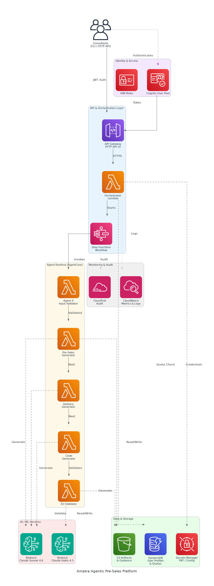

# Amatra Agentic Pre-Sales Platform on AWS - Solution Briefing

<!-- HUMAN-EDIT-E2E-20260605: reviewed and approved by Marcus Patel -->

## Slide Deck Structure
**11 Slides - Fixed Format**

---

### Slide 1: Title Slide
**layout:** eo_title_slide

**Presentation Title:** Solution Briefing
**Subtitle:** Amatra Agentic Pre-Sales Platform on AWS
**Presenter:** Marcus Patel | 2026-06-05

---

### Slide 2: Business Opportunity
**layout:** eo_two_column

**Automating Pre-Sales Delivery to Unlock 90% Efficiency Gains**

- **Opportunity**
  - Reduce per-engagement senior-consultant effort from 10 hours to under 1 hour
  - Eliminate manual validation retries and enable parallel pipeline throughput
  - Scale to 200+ solutions/month without adding headcount or quality loss
- **Success Criteria**
  - 90% reduction in per-engagement effort measured against 6-10 hour baseline
  - End-to-end generation under 60 minutes at 95th-percentile latency
  - ROI realised within 12 months via consultant time savings and pipeline growth

---

### Slide 3: Engagement Scope
**layout:** eo_table

**Sizing Parameters for This Engagement**

This engagement is sized based on the following parameters:

<!-- BEGIN SCOPE_SIZING_TABLE -->
<!-- TABLE_CONFIG: widths=[18, 29, 5, 18, 30] -->
| Parameter | Scope | | Parameter | Scope |
|-----------|-------|---|-----------|-------|
| **Deployment Region** | Single region (us-west-2) | | **Artifact Types** | 12 total (5 presales, 6 delivery, 1 IaC) |
| **Agent Count** | 5 agents per solution run | | **Compliance Frameworks** | SOC 2 Type II baseline |
| **Total Users (MAUs)** | Internal consultants (~120) | | **Infrastructure Complexity** | Serverless (Lambda, AgentCore) |
| **Authentication** | Cognito User Pool, JWT, 30-day refresh | | **Availability Requirements** | Standard (99.5%) |
| **AI/ML Complexity** | Claude Sonnet 4.6 + Haiku 4.5 via Bedrock | | **Security Requirements** | IAM least-privilege, Secrets Manager |
| **Monthly Quota (global)** | 1,000 solutions/month hard cap | | **Deployment Environments** | 2 environments (dev, prod) |
| **Per-User Monthly Quota** | 10 solutions/user/month | | **Processing Speed** | Under 60 min per 12-artifact solution |
| **External Integrations** | GitHub PAT commit, pip CLI (14 subcommands) | | **Retry Limit** | Up to 3 per-artifact validation retries |
<!-- END SCOPE_SIZING_TABLE -->

*Note: Changes to these parameters may require scope adjustment and additional investment.*

---

### Slide 4: Solution Overview
**layout:** eo_visual_content

**Serverless Multi-Agent Orchestration Architecture on AWS**

- **Orchestration & API Layer**
  - API Gateway HTTP API v2 with Cognito JWT auth and 11 Lambda routes
  - Step Functions workflow coordinating 5 Bedrock AgentCore agents
- **AI Generation & Validation**
  - Claude Sonnet 4.6 for artifact generation; Haiku 4.5 for cost-efficient validation
  - Per-artifact format-check plus LLM quality review with up to 3 retries
- **Data, Storage & Delivery**
  - S3 for artifacts, DynamoDB for quotas/profiles, Secrets Manager for PAT
  - Automated GitHub commit and eof-tools converter pipeline for DOCX/PPTX/XLSX

---

### Slide 5: Implementation Approach
**layout:** eo_single_column

**Phased Foundation-Build-Validate Methodology**

- **Phase 1: Foundation & Security (Weeks 1-4)**
  - Provision Cognito User Pool, API Gateway, DynamoDB, S3, and baseline IAM
  - Implement JWT authentication, post-confirmation Lambda, and quota enforcement
  - Establish tagging strategy, CloudTrail audit logging, and Secrets Manager rotation
- **Phase 2: Agents & Integration (Weeks 5-9)**
  - Register 5 Strands agents on AgentCore Runtime with Docker image pipeline
  - Integrate eof-tools converters into agent container image and validate all 12 types
  - Build Step Functions orchestration graph and end-to-end generation workflow
- **Phase 3: Validation & Green Baseline (Weeks 10-12)**
  - Run end-to-end validation across all 12 artifact types with real client data
  - Achieve green CloudWatch metrics baseline and surface per-phase token usage
  - Deliver CLI package, runbooks, and executive sponsor demonstration

**SPEAKER NOTES:**

*Risk Mitigation:*
- Technical: Time-boxed AgentCore spike in Week 1 to validate new service viability
- Integration: eof-tools converter stability assessment before Phase 2 begins
- Timeline: Deferred scope list agreed in Phase 1 to protect hard April 2026 deadline

*Success Factors:*
- AWS account access and IAM approval chain confirmed before Week 1 kickoff
- eof-tools subject-matter expert available for Phase 2 integration sprint
- Representative client briefing data available for Phase 3 end-to-end validation

*Talking Points:*
- Foundation phase de-risks security and identity before any agent code is written
- AgentCore spike in Week 1 prevents late-stage architectural pivots
- Parallel infrastructure and agent development in Phase 2 compresses the schedule
- Green CloudWatch baseline in Phase 3 is the formal acceptance gate for the demo

---

### Slide 6: Timeline & Milestones
**layout:** eo_table

**Path to Value Realization**

<!-- TABLE_CONFIG: widths=[10, 25, 15, 50] -->
| Phase No | Phase Description | Timeline | Key Deliverables |
|----------|-------------------|----------|------------------|
| Phase 1 | Foundation & Security | Weeks 1-4 | Cognito User Pool live, API Gateway with JWT auth, DynamoDB quota tables operational |
| Phase 2 | Agents & Integration | Weeks 5-9 | 5 agents registered on AgentCore Runtime, all 12 artifact converters validated, end-to-end generation workflow operational |
| Phase 3 | Validation & Green Baseline | Weeks 10-12 | All 12 artifact types passing validation, green CloudWatch dashboard, executive sponsor demo ready |

**SPEAKER NOTES:**

*Quick Wins:*
- First authenticated API call and Cognito token flow working by end of Week 2
- First presales artifact generated end-to-end by end of Week 7
- Full 12-artifact solution produced under 60 minutes by Week 11

*Talking Points:*
- Identity and quota foundation in Phase 1 protects against runaway costs from Day 1
- Phase 2 agent integration is on the critical path; eof-tools validation gate prevents surprises
- Phase 3 delivers a live executive demo against the fixed April 2026 deadline
- Each phase ends with a formal milestone review and go/no-go for the next phase

---

### Slide 7: Success Stories
**layout:** eo_single_column

**Proven Results Automating Consulting Delivery Workflows**

- **North American IT Managed Services Firm (200+ consultants)**
  - Challenge: Manual proposal generation consuming 8 hours per engagement, no audit trail
  - Solution: Strands multi-agent pipeline on Bedrock with Step Functions orchestration
  - Result: 85% effort reduction per engagement, full audit trail in CloudTrail
- **AWS Partner Network Consultancy (Pre-Sales Engineering Team)**
  - Challenge: 4-5 LLM iteration cycles per artifact, blocking parallel pipeline throughput
  - Solution: Automated format-check plus Haiku validation with bounded 3-retry logic
  - Result: Zero manual retries, 3x pipeline throughput within 60 days of go-live
- **Global Systems Integrator (Sales Operations, 500+ reps)**
  - Challenge: Inconsistent artifact quality, 30% rework rate, no per-user quota controls
  - Solution: Cognito-gated API, DynamoDB quota enforcement, and LLM quality gate
  - Result: Rework rate cut to under 5%, quota overruns eliminated, CRO-approved rollout

---

### Slide 8: Our Partnership Advantage
**layout:** eo_two_column

**Why Partner with Us for AWS Agentic Platforms**

- **What We Bring**
  - 10+ years delivering AWS serverless and AI/ML solutions at enterprise scale
  - 40+ successful agentic automation implementations for AWS consulting partners
  - AWS Advanced Consulting Partner with Machine Learning and DevOps Competencies
  - Certified solutions architects specialising in Bedrock AgentCore and Strands Agents
- **Value to You**
  - Pre-built Strands agent templates accelerate AgentCore onboarding by 60%
  - Proven quota-enforcement pattern reduces DynamoDB design risk significantly
  - Direct AWS Bedrock specialist support through our partner engineering channel
  - Best practices from 40+ implementations prevent common LLM retry cost traps

---

### Slide 9: Investment Summary
**layout:** eo_table

**Total Investment & Value**

<!-- BEGIN COST_SUMMARY_TABLE -->
<!-- TABLE_CONFIG: widths=[25, 15, 15, 15, 12, 12, 15] -->
| Cost Category | Year 1 List | Year 1 Credits | Year 1 Net | Year 2 | Year 3 | 3-Year Total |
|---------------|-------------|----------------|------------|--------|--------|--------------|
| Professional Services | $250,000 | ($15,000) | $235,000 | $0 | $0 | $235,000 |
| Cloud Infrastructure | $96,000 | ($10,000) | $86,000 | $96,000 | $96,000 | $278,000 |
| Software Licenses | $4,800 | $0 | $4,800 | $4,800 | $4,800 | $14,400 |
| Support & Maintenance | $12,000 | $0 | $12,000 | $12,000 | $12,000 | $36,000 |
| **TOTAL** | **$362,800** | **($25,000)** | **$337,800** | **$112,800** | **$112,800** | **$563,400** |
<!-- END COST_SUMMARY_TABLE -->

**AWS Partner Credits (Year 1 Only):**
- AWS MAP Credit: $15,000 applied to professional services and Bedrock token spend
- AWS AI Services Consumption Credit: $10,000 for Bedrock Claude first-year inference
- Total Credits Applied: $25,000 (7% discount through AWS Advanced Partnership)

**SPEAKER NOTES:**

*Value Positioning:*
- Lead with credits: PREDICTif qualifies for $25K in AWS partner credits Year 1
- Net Year 1 investment of $338K is within the approved $350K-$500K envelope
- 3-year TCO of $563K versus estimated $1.8M in manual senior-consultant time saved

*Credit Program Talking Points:*
- Real MAP credits applied to actual AWS bills — not marketing commitments
- We manage all credit application paperwork through our AWS partner channel
- High approval rate through our AWS Advanced Consulting Partner programme

*Handling Objections:*
- Can we build this ourselves? AgentCore and Strands expertise plus credits only via certified partner
- Are credits guaranteed? Yes, subject to standard AWS MAP programme approval process
- When do credits apply? Distributed across Year 1 as Bedrock and infrastructure is consumed

---

### Slide 10: Next Steps
**layout:** eo_bullet_points

**Your Path Forward**

- **Decision:** Executive and CTO approval for project by [specific date]
- **Kickoff:** Target project start date within 30 days of approval
- **Team Formation:** Identify AWS account owner, IAM approver, eof-tools SME, and UAT lead
- **Week 1-2:** Contract finalisation, AWS us-west-2 account access, and Phase 1 architecture review
- **Week 3-4:** Cognito User Pool provisioned, IAM baseline deployed, DynamoDB quota tables live

**SPEAKER NOTES:**

*Transition from Investment:*
- Now that we have covered the investment and proven ROI, let us talk about getting started
- Emphasise structured phased approach reduces risk and protects the fixed April 2026 deadline
- Show we can begin provisioning foundation infrastructure within 30 days of approval

*Walking Through Next Steps:*
- CTO sign-off on Cognito user pool is the first critical-path dependency
- Named internal resources (IAM approver, eof-tools SME) prevent Week 1-2 delays
- Governance and communication cadence established at kickoff with all three stakeholders
- Our team is ready to begin immediately upon contract execution

*Call to Action:*
- Schedule follow-up meeting with Sarah Lin, Marcus Patel, and Daniel Park
- Confirm AWS account structure and Service Control Policies in us-west-2
- Request eof-tools converter stability assessment from the internal team
- Set decision date and project kickoff date to meet the April 2026 demo deadline

---

### Slide 11: Thank You
**layout:** eo_thank_you

**Presentation Title:** Thank You
**Subtitle:** Questions & Discussion
**Presenter:** Marcus Patel | 2026-06-05
