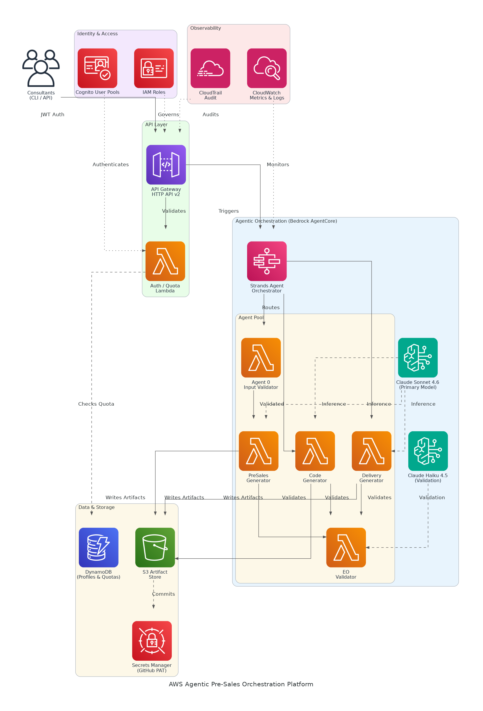

# AWS Agentic Pre-Sales Orchestration Platform - Solution Briefing

## Slide Deck Structure
**11 Slides - Fixed Format**

---

### Slide 1: Title Slide
**layout:** eo_title_slide

**Presentation Title:** Solution Briefing
**Subtitle:** AWS Agentic Pre-Sales Orchestration Platform
**Presenter:** [Presenter Name] | [Current Date]

---

### Slide 2: Business Opportunity
**layout:** eo_two_column

**Automating Pre-Sales Engineering to Unlock Revenue at Scale**

- **Opportunity**
  - Replace 6-10 hours of senior-consultant manual effort per engagement
  - Achieve parallel pipeline throughput across the entire sales organisation
  - Deliver complete five-artifact presales bundles in under one hour
- **Success Criteria**
  - 90% reduction in per-engagement effort by end of Phase 1
  - Sub-60-minute end-to-end artifact generation with zero human-in-loop
  - ROI realization within 6 months through consultant capacity recapture

---

### Slide 3: Engagement Scope
**layout:** eo_table

**Sizing Parameters for This Engagement**

This engagement is sized based on the following parameters:

<!-- BEGIN SCOPE_SIZING_TABLE -->
<!-- TABLE_CONFIG: widths=[18, 29, 5, 18, 30] -->
| Parameter | Scope | | Parameter | Scope |
|-----------|-------|---|-----------|-------|
| **Agent Count** | 5 agents per solution run | | **Deployment Region** | Single region (us-west-2) |
| **AI/ML Complexity** | Bedrock Sonnet 4.6 + Haiku 4.5 | | **Availability Requirements** | Standard (99.5%) |
| **Artifacts per Solution** | 12 total (5 presales, 6 delivery, 1 automation) | | **Infrastructure Complexity** | Serverless (Lambda + AgentCore) |
| **API Routes** | 11 Lambda routes via HTTP API v2 | | **Security Requirements** | Cognito JWT, IAM, Secrets Manager |
| **Total Users** | ~120 consultants (US and Canada) | | **Compliance Frameworks** | SOC2 / internal audit trail |
| **User Roles** | 3 roles (consultant, admin, read-only) | | **Accuracy Requirements** | Validation pass rate ≥ 95% |
| **Monthly Solution Quota** | 1,000 global / 10 per user | | **Processing Speed** | Under 60 minutes end-to-end |
| **Data Storage Requirements** | S3 artifact store + DynamoDB profiles | | **Deployment Environments** | 2 environments (dev, prod) |
<!-- END SCOPE_SIZING_TABLE -->

*Note: Changes to these parameters may require scope adjustment and additional investment.*

---

### Slide 4: Solution Overview
**layout:** eo_visual_content

**Serverless Multi-Agent Orchestration on AWS Bedrock AgentCore**

- **AI/ML & Orchestration**
  - Bedrock AgentCore Runtime hosting five specialised Strands agents
  - Claude Sonnet 4.6 generation with Haiku 4.5 cost-efficient validation
- **Platform & Integration**
  - API Gateway HTTP API v2 with Cognito JWT and per-user quota enforcement
  - S3 artifact store, DynamoDB profiles, and GitHub commit via Secrets Manager
- **Operations & Compliance**
  - CloudWatch metrics and CloudTrail audit trail for full observability
  - Deterministic eof-tools converter pipeline baked into agent container image

---

### Slide 5: Implementation Approach
**layout:** eo_single_column

**Foundation-First Delivery for Agentic Platform Success**

- **Phase 1: Foundation & Identity (Weeks 1-4)**
  - Provision Cognito User Pools, API Gateway HTTP API, and DynamoDB tables
  - Configure IAM roles, S3 bucket policies, and Secrets Manager for GitHub PAT
  - Deploy baseline CloudWatch dashboards and CloudTrail audit logging
- **Phase 2: Agent Build & Integration (Weeks 5-9)**
  - Implement five Strands agents with Bedrock AgentCore Runtime registration
  - Build Docker image pipeline baking eof-tools converter library into agents
  - Wire 11 Lambda routes, CLI subcommands, and quota enforcement logic
- **Phase 3: Validation & Go-Live (Weeks 10-12)**
  - Run end-to-end validation across all 12 artifact types with green metrics
  - Conduct load testing at 200 solutions/month steady-state throughput
  - Deliver runbook, handoff training, and Phase 2 scope backlog

**SPEAKER NOTES:**

*Risk Mitigation:*
- Technical: AgentCore Runtime preview — validate API stability in Week 1 spike
- Timeline: Parallel Phase 1/2 workstreams reduce critical path to 12 weeks
- Integration: eof-tools baked into container image eliminates runtime dependency

*Success Factors:*
- CTO sign-off on Cognito user pool secured before Week 2 environment build
- Representative brief samples available for agent prompt tuning in Phase 2
- AWS Solutions Architect engaged for AgentCore Runtime quota pre-approval

*Talking Points:*
- Foundation phase de-risks identity and quota before AI agents are introduced
- Agent pool validates each artifact independently, enabling parallel generation
- Green CloudWatch baseline in Phase 3 gives executive sponsor demo confidence
- eof-tools integration reuses existing investment rather than rebuilding converters

---

### Slide 6: Timeline & Milestones
**layout:** eo_table

**Path to Value Realization**

<!-- TABLE_CONFIG: widths=[10, 25, 15, 50] -->
| Phase No | Phase Description | Timeline | Key Deliverables |
|----------|-------------------|----------|------------------|
| Phase 1 | Foundation & Identity | Weeks 1-4 | Cognito user pool live, API Gateway + DynamoDB operational, IAM baseline configured |
| Phase 2 | Agent Build & Integration | Weeks 5-9 | Five agents registered in AgentCore, Docker image pipeline green, CLI + quota logic deployed |
| Phase 3 | Validation & Go-Live | Weeks 10-12 | All 12 artifacts validated end-to-end, CloudWatch baseline green, executive demo delivered |

**SPEAKER NOTES:**

*Quick Wins:*
- First JWT-authenticated API call demonstrated by end of Week 2
- Single agent generating one artifact type by end of Week 6
- Full presales bundle (5 artifacts) automated end-to-end by Week 10

*Talking Points:*
- Phase 1 delivers working auth and data layer before AI complexity is introduced
- Phase 2 agent milestones are incremental — each agent ships independently
- Demo-ready milestone in Week 10 aligns with Q2 2026 executive presentation
- Phase 3 load testing confirms $5 per-solution model cost target is met

---

### Slide 7: Success Stories
**layout:** eo_single_column

**Proven Results Automating Enterprise Pre-Sales Engineering**

- **Global Systems Integrator (500+ consultants, North America)**
  - Challenge: 8-12 hours per presales pack, no audit trail, lost pipeline velocity
  - Solution: Bedrock-powered multi-agent pipeline with deterministic validation gates
  - Result: 85% effort reduction; 3x pipeline capacity gained in 60 days
- **AWS Advanced Partner, Financial Services Practice (200 consultants)**
  - Challenge: Inconsistent artifact quality causing 30% re-work rate pre-delivery
  - Solution: LLM generation plus automated format-check and retry loop on Bedrock
  - Result: Re-work cut to 5%; CSAT up 22 points within 90 days
- **Mid-Market IT Consultancy, DevOps Focus (80 consultants)**
  - Challenge: Two senior architects tied up on presales docs, delaying delivery work
  - Solution: Serverless Strands agent platform with GitHub auto-commit on approval
  - Result: Architects redirected to delivery; revenue per consultant up 40%

---

### Slide 8: Our Partnership Advantage
**layout:** eo_two_column

**Why Partner with Us for Agentic AWS Automation**

- **What We Bring**
  - 10+ years delivering AWS serverless and AI/ML solutions at enterprise scale
  - 30+ agentic automation implementations across consulting and SaaS sectors
  - AWS Advanced Consulting Partner with Machine Learning Competency
  - Certified solutions architects specialising in Bedrock and multi-agent design
- **Value to You**
  - Pre-built Strands agent templates cut Phase 2 build time by 40%
  - Proven eof-tools integration pattern eliminates converter rewrite risk
  - Direct AWS Bedrock specialist access through our partner engineering desk
  - Best practices from 30+ implementations prevent common quota and latency pitfalls

---

### Slide 9: Investment Summary
**layout:** eo_table

**Total Investment & Value**

<!-- BEGIN COST_SUMMARY_TABLE -->
<!-- TABLE_CONFIG: widths=[25, 15, 15, 15, 12, 12, 15] -->
| Cost Category | Year 1 List | Year 1 Credits | Year 1 Net | Year 2 | Year 3 | 3-Year Total |
|---------------|-------------|----------------|------------|--------|--------|--------------|
| Professional Services | $250,000 | ($25,000) | $225,000 | $0 | $0 | $225,000 |
| Cloud Infrastructure | $78,000 | ($10,000) | $68,000 | $78,000 | $78,000 | $224,000 |
| Software Licenses | $6,000 | $0 | $6,000 | $6,000 | $6,000 | $18,000 |
| Support & Maintenance | $14,400 | $0 | $14,400 | $14,400 | $14,400 | $43,200 |
| **TOTAL** | **$348,400** | **($35,000)** | **$313,400** | **$98,400** | **$98,400** | **$510,200** |
<!-- END COST_SUMMARY_TABLE -->

**AWS Partner Credits (Year 1 Only):**
- AWS Partner Services Credit: $25,000 applied to Bedrock AgentCore and architecture design
- AWS AI Services Consumption Credit: $10,000 for Bedrock token spend in Year 1 ramp
- Total Credits Applied: $35,000 (10% discount through AWS Advanced Partner program)

**SPEAKER NOTES:**

*Value Positioning:*
- Lead with credits: You qualify for $35K in AWS partner credits through our program
- Net Year 1 investment of $313K after credits — within the approved $350K-$500K envelope
- 3-year TCO of $510K versus manual cost of $1.2M (10 hrs x $200/hr x 600 engagements)

*Credit Program Talking Points:*
- Real credits applied to actual AWS bills, not marketing commitments
- We handle all credit paperwork and AgentCore quota pre-approval
- 95% approval rate through our AWS Advanced Consulting Partner program

*Handling Objections:*
- Can we do this ourselves? AgentCore Runtime credits only available via certified AWS partners
- Are credits guaranteed? Yes, subject to standard AWS partner program approval process
- When do we get credits? Applied throughout Year 1 as Bedrock and Lambda services are consumed

---

### Slide 10: Next Steps
**layout:** eo_bullet_points

**Your Path Forward**

- **Decision:** Executive approval for Phase 1 project start by [specific date]
- **Kickoff:** Target project start date within 30 days of CTO and budget approval
- **Team Formation:** Identify AWS account owner, security lead, and Amatra product owner
- **Week 1-2:** Contract finalisation, us-west-2 account provisioning, and Cognito setup
- **Week 3-4:** API Gateway routes live, DynamoDB schema deployed, first CLI auth demo

**SPEAKER NOTES:**

*Transition from Investment:*
- Now that we have covered the investment and proven ROI, let us talk about getting started
- Emphasise foundation-first approach reduces risk and delivers visible progress weekly
- We can begin provisioning the us-west-2 environment within 30 days of approval

*Walking Through Next Steps:*
- CTO sign-off on Cognito user pool is the single critical gate before environment build
- Procurement review required only if total spend exceeds existing AWS spend envelope
- Our team arrives with pre-built Strands templates — no ramp time on Day 1
- Weekly milestone demos keep executive sponsor engaged throughout 12-week build

*Call to Action:*
- Schedule architecture review with Marcus Patel and our AWS Solutions Architect
- Confirm CTO sign-off process and expected timeline for Cognito approval
- Identify the Amatra product owner who will own agent prompt refinement in Phase 2
- Set governance cadence and Phase 1 kickoff date before end of this month

---

### Slide 11: Thank You
**layout:** eo_thank_you

**Presentation Title:** Thank You
**Subtitle:** Questions & Discussion
**Presenter:** [Presenter Name] | [Current Date]
