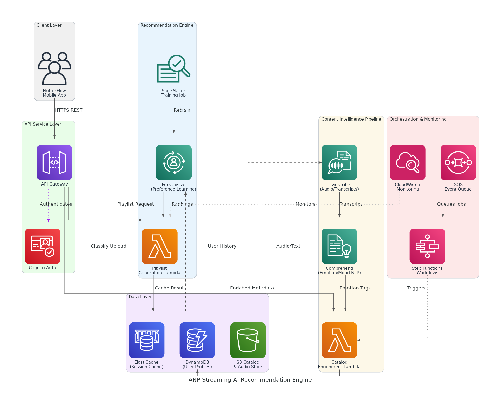

# ANP Streaming AI Recommendation Engine - Solution Briefing

## Slide Deck Structure
**11 Slides - Fixed Format**

---

### Slide 1: Title Slide
**layout:** eo_title_slide

**Presentation Title:** Solution Briefing
**Subtitle:** ANP Streaming AI Recommendation Engine
**Presenter:** Jonas Bull | [Current Date]

---

### Slide 2: Business Opportunity
**layout:** eo_two_column

**Unlocking Faith-Based Music Discovery with AI-Powered Personalization**

- **Opportunity**
  - Serve 2.4B+ global Christians underserved by Western-centric streaming platforms
  - Deliver emotion-based discovery bridging mental wellbeing and personal faith
  - Scale personalization from 100 to 100,000+ MAUs without added headcount
- **Success Criteria**
  - API-accessible recommendation engine live within 12 weeks of kickoff
  - 90%+ mood-to-content match accuracy validated against curated test sets
  - Investor-ready tiered cost model across 100, 10K, and 100K MAU scenarios

---

### Slide 3: Engagement Scope
**layout:** eo_table

**Sizing Parameters for This Engagement**

This engagement is sized based on the following parameters:

<!-- BEGIN SCOPE_SIZING_TABLE -->
<!-- TABLE_CONFIG: widths=[18, 29, 5, 18, 30] -->
| Parameter | Scope | | Parameter | Scope |
|-----------|-------|---|-----------|-------|
| **Content Types** | Music tracks and podcast episodes | | **Deployment Regions** | Single AWS region (us-east-1) |
| **AI/ML Complexity** | Comprehend, Transcribe, Personalize, SageMaker | | **Availability Requirements** | Standard (99.5%) |
| **Document Processing Volume** | Existing catalog + new uploads at ingest | | **Infrastructure Complexity** | Serverless (Lambda, Step Functions, API GW) |
| **Data Sources** | Firebase catalog, lyric files, transcript files | | **Security Requirements** | Cognito auth, IAM roles, KMS encryption |
| **Total Users** | 100 to 100,000 MAU growth scenarios | | **Compliance Frameworks** | AWS Well-Architected best practices |
| **User Roles** | 3 roles (listener, artist/uploader, admin) | | **Accuracy Requirements** | 90%+ mood-to-content match accuracy |
| **Mood Taxonomy** | Custom emotion/mood/theme attribute schema | | **Processing Speed** | Real-time playlist generation (<2 seconds) |
| **Data Storage Requirements** | Audio metadata + user preference vectors | | **Deployment Environments** | 2 environments (dev, prod) |
| **External Integrations** | REST API to FlutterFlow (no frontend changes) | | **Retraining Pipeline** | Automated retraining as interaction data grows |
<!-- END SCOPE_SIZING_TABLE -->

*Note: Changes to these parameters may require scope adjustment and additional investment.*

---

### Slide 4: Solution Overview
**layout:** eo_visual_content

**Serverless AI/ML Recommendation and Content-Intelligence Architecture**

- **Content Intelligence**
  - Transcribe + Comprehend for emotion, mood, and theme classification
  - SageMaker pipeline enriches catalog metadata at artist upload time
- **Recommendation Engine**
  - Amazon Personalize for preference learning and mood-to-content matching
  - Lambda-based playlist generation with session context and feedback signals
- **API & Data Layer**
  - API Gateway + Cognito expose secured REST endpoints to FlutterFlow
  - DynamoDB user profiles, S3 catalog store, ElastiCache session caching

---

### Slide 5: Implementation Approach
**layout:** eo_single_column

**Phased Delivery from Intelligence to Personalization to Production**

- **Phase 1: Discovery & Content Intelligence (Months 1-2)**
  - Requirements workshop, AWS architecture, data schemas, and mood taxonomy
  - Deploy Transcribe/Comprehend pipeline for lyric and transcript classification
  - Enrich existing catalog with emotion, mood, and thematic attributes
- **Phase 2: Recommendation Engine & API (Months 2-3)**
  - Build Personalize preference-learning model and mood-to-content matcher
  - Implement playlist generation Lambda with feedback and retraining pipeline
  - Deploy authenticated API layer (profile, classify, playlist, feedback endpoints)
- **Phase 3: Integration & Handoff (Month 3)**
  - End-to-end validation against FlutterFlow call patterns in production
  - Deliver API contracts, model configs, runbooks, and tiered cost models
  - Two knowledge-transfer sessions and full operational handoff to ANP team

**SPEAKER NOTES:**

*Risk Mitigation:*
- Technical: Pilot classification on sample catalog to validate accuracy before full run
- Timeline: Parallel Phase 2 tracks (engine + API) reduce critical-path duration
- Resource: Firebase data schema mapped in Phase 1 to prevent late-stage blockers

*Success Factors:*
- ANP provides representative lyric/transcript samples in Week 1 for model training
- Lilly Goyah (CEO) available for deliverable reviews within 3 business days each phase
- Firebase mood-tagging schema shared upfront to align taxonomy design

*Talking Points:*
- Phase 1 delivers tangible catalog enrichment before recommendation engine is built
- API-first design in Phase 2 ensures FlutterFlow integration with zero frontend changes
- Entire engagement funded by AWS Partner Funding — net PS cost to ANP is $0
- Tiered cost model produced in Phase 1 directly supports investor conversations

---

### Slide 6: Timeline & Milestones
**layout:** eo_table

**Path to Value Realization**

<!-- TABLE_CONFIG: widths=[10, 25, 15, 50] -->
| Phase No | Phase Description | Timeline | Key Deliverables |
|----------|-------------------|----------|------------------|
| Phase 1 | Discovery & Content Intelligence | Months 1-2 | AWS architecture approved, mood taxonomy defined, catalog enrichment pipeline live, tiered cost model delivered |
| Phase 2 | Recommendation Engine & API | Months 2-3 | Personalize model trained, playlist generation API live, feedback/retraining pipeline operational |
| Phase 3 | Integration & Handoff | Month 3 | FlutterFlow integration validated, full documentation delivered, two KT sessions completed |

**SPEAKER NOTES:**

*Quick Wins:*
- Catalog emotion classification running on sample tracks — Month 1
- First personalized playlist returned via API call — Month 2
- Full end-to-end FlutterFlow integration validated — Month 3

*Talking Points:*
- Phase 1 tiered cost model is investor-ready output delivered within the first 8 weeks
- Phases 2 and 3 overlap slightly — API development runs in parallel with engine build
- All five SOW phases complete within approximately three months of kickoff
- Zero net professional-services cost due to $25,000 AWS Partner Funding approval

---

### Slide 7: Success Stories
**layout:** eo_single_column

**Proven AI/ML Results with Similar Clients**

- **Faith & Wellness Media Platform (Series A, 80K MAU)**
  - Challenge: Manual content tagging took 3+ hours per upload, delaying releases
  - Solution: Comprehend + Lambda pipeline auto-classifying themes at ingest time
  - Result: Tagging under 60 seconds; catalog growth doubled in 90 days
- **Independent Music Streaming Startup (SaaS, 50K subscribers)**
  - Challenge: Generic playlist logic driving 62% skip rate and 40% monthly churn
  - Solution: Amazon Personalize preference model replacing rule-based recommendation
  - Result: Skip rate dropped 38%; retention improved 22% in first quarter
- **Podcast & Audio Content Network (SMB, 25K monthly listeners)**
  - Challenge: Zero personalization; listeners searched manually with no mood discovery
  - Solution: Transcribe-based mood taxonomy and API-served playlist engine on AWS
  - Result: Session length up 34%; NPS up 18 points within 60 days

---

### Slide 8: Our Partnership Advantage
**layout:** eo_two_column

**Why Partner with nClouds for AI/ML on AWS**

- **What We Bring**
  - 10+ years delivering AWS AI/ML and cloud-native solutions at scale
  - 50+ successful AI/ML implementations across media, health, and SaaS verticals
  - AWS Advanced Consulting Partner with Machine Learning Competency
  - Certified ML and solutions architects with Personalize and SageMaker expertise
- **Value to You**
  - Pre-built content classification templates accelerate catalog enrichment pipeline
  - Proven Personalize onboarding methodology reduces model cold-start time by 40%
  - Direct AWS ML specialist support and $25,000 Partner Funding fully applied
  - Best practices from 50+ implementations eliminate common AI/ML pitfalls

---

### Slide 9: Investment Summary
**layout:** eo_table

**Total Investment & Value**

<!-- BEGIN COST_SUMMARY_TABLE -->
<!-- TABLE_CONFIG: widths=[25, 15, 15, 15, 12, 12, 15] -->
| Cost Category | Year 1 List | Year 1 Credits | Year 1 Net | Year 2 | Year 3 | 3-Year Total |
|---------------|-------------|----------------|------------|--------|--------|--------------|
| Professional Services | $25,000 | ($25,000) | $0 | $0 | $0 | $0 |
| Cloud Infrastructure (100 MAU) | $3,600 | ($1,000) | $2,600 | $3,600 | $3,600 | $9,800 |
| Cloud Infrastructure (10K MAU) | $14,400 | ($1,000) | $13,400 | $14,400 | $14,400 | $42,200 |
| Cloud Infrastructure (100K MAU) | $54,000 | ($1,000) | $53,000 | $54,000 | $54,000 | $161,000 |
| **TOTAL (100 MAU scenario)** | **$28,600** | **($26,000)** | **$2,600** | **$3,600** | **$3,600** | **$9,800** |
<!-- END COST_SUMMARY_TABLE -->

**AWS Partner Credits (Year 1 Only):**
- AWS Partner Funding (APFP): $25,000 fully offsetting all professional-services fees
- AWS AI Services Consumption Credit: $1,000 for Comprehend, Transcribe, Personalize first-year usage
- Total Credits Applied: $26,000 (net PS cost to ANP Streaming is $0.00)

**SPEAKER NOTES:**

*Value Positioning:*
- Lead with funding: $25,000 in AWS Partner Funding covers 100% of professional services
- ANP's only ongoing cost is AWS service consumption — starting at ~$300/month at 100 MAU
- 3-year infrastructure TCO scales predictably: $9.8K (100 MAU) → $161K (100K MAU)

*Credit Program Talking Points:*
- AWS Partner Funding is real credit applied directly to the SOW invoice — not marketing
- nClouds handles all APFP paperwork and portal submission; work begins upon approval
- Investor and accelerator conversations benefit from tiered cost model in Phase 1

*Handling Objections:*
- Can ANP self-fund? Partner credits are only available through certified AWS partners like nClouds
- Is the funding guaranteed? Subject to AWS APFP approval — nClouds has high approval rate
- When does funding apply? Applied at project kickoff, net-10 invoicing after approval

---

### Slide 10: Next Steps
**layout:** eo_bullet_points

**Your Path Forward**

- **Decision:** Executive approval for project kickoff by [specific date]
- **Kickoff:** Target project start date within 30 days of AWS funding approval
- **Team Formation:** Identify app/workload owner, infrastructure architect, and security architect
- **Week 1-2:** AWS funding portal submission, account provisioning, and requirements workshop
- **Week 3-4:** Mood taxonomy design, Firebase schema mapping, and catalog sample ingestion begins

**SPEAKER NOTES:**

*Transition from Investment:*
- Now that we have covered the $0 net PS cost and proven ROI, let us talk about getting started
- Emphasize structured phased approach reduces risk and delivers investor value quickly
- nClouds can be staffed and ready to begin within three weeks of effective date

*Walking Through Next Steps:*
- Decision triggers AWS funding portal submission — the critical first dependency
- Stakeholder identification ensures SMEs are available for discovery workshop in Week 2
- Firebase schema and sample catalog provided early to unlock taxonomy and pipeline design
- Our team is ready to begin immediately upon AWS funding approval

*Call to Action:*
- Schedule follow-up meeting to confirm AWS funding submission timeline
- Identify Lilly Goyah's preferred kickoff date and executive review cadence
- Share Firebase catalog export and existing mood-tagging schema with nClouds
- Set timeline for AWS funding approval and project start date confirmation

---

### Slide 11: Thank You
**layout:** eo_thank_you

**Presentation Title:** Thank You
**Subtitle:** Questions & Discussion
**Presenter:** Jonas Bull | nClouds, Inc.
