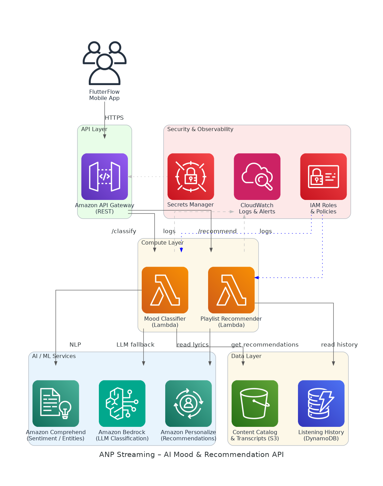

# ANP Streaming AI Mood & Recommendation API - Solution Briefing

## Slide Deck Structure
**11 Slides - Fixed Format**

---

### Slide 1: Title Slide
**layout:** eo_title_slide

**Presentation Title:** Solution Briefing
**Subtitle:** ANP Streaming AI Mood & Recommendation API
**Presenter:** Jonas Bull | [Current Date]

---

### Slide 2: Business Opportunity
**layout:** eo_two_column

**Unlocking Personalized Faith-Based Content Discovery with AI**

- **Opportunity**
  - Boost listener engagement by surfacing mood-matched songs and podcasts instantly
  - Auto-tag every new upload with mood labels, eliminating manual curation effort
  - Deliver personalized playlists without rebuilding the existing FlutterFlow frontend
- **Success Criteria**
  - 90%+ mood-classification accuracy validated against labeled content samples
  - Personalized playlist API live within 6 weeks of engagement kickoff
  - AWS funding offsets 100% of professional-services investment in Year 1

---

### Slide 3: Engagement Scope
**layout:** eo_table

**Sizing Parameters for This Engagement**

This engagement is sized based on the following parameters:

<!-- BEGIN SCOPE_SIZING_TABLE -->
<!-- TABLE_CONFIG: widths=[18, 29, 5, 18, 30] -->
| Parameter | Scope | | Parameter | Scope |
|-----------|-------|---|-----------|-------|
| **Content Types** | Songs and podcasts (lyrics / transcripts) | | **Deployment Regions** | Single AWS region (us-east-1) |
| **AI/ML Complexity** | Comprehend + Bedrock (LLM fallback) | | **Availability Requirements** | Standard (99.5%) |
| **API Endpoints** | 2 REST endpoints (classify, recommend) | | **Infrastructure Complexity** | Serverless (Lambda, API Gateway) |
| **Data Sources** | Firebase catalog exported to S3 | | **Security Requirements** | IAM, Secrets Manager, HTTPS only |
| **Total Users** | Small initial user base (<5,000) | | **Compliance Frameworks** | None mandated at launch |
| **User Roles** | End users via FlutterFlow app | | **Accuracy Requirements** | 90%+ mood classification accuracy |
| **Document Processing Volume** | On-demand per upload and per request | | **Processing Speed** | Real-time (<2s p95 latency) |
| **Data Storage Requirements** | <50 GB catalog and history data | | **Deployment Environments** | 2 environments (dev, prod) |
<!-- END SCOPE_SIZING_TABLE -->

*Note: Changes to these parameters may require scope adjustment and additional investment.*

---

### Slide 4: Solution Overview
**layout:** eo_visual_content

**Serverless AWS AI Mood Classification and Recommendation Architecture**

- **AI / ML Services**
  - Comprehend and Bedrock for mood classification from lyrics/transcripts
  - Amazon Personalize for real-time personalized playlist recommendations
- **Platform Architecture**
  - Serverless Lambda functions behind API Gateway for both endpoints
  - S3 catalog, DynamoDB history, CloudWatch monitoring for full observability
- **Security & Integration**
  - IAM roles and Secrets Manager enforce least-privilege access controls
  - REST API callable from FlutterFlow with no frontend changes required

---

### Slide 5: Implementation Approach
**layout:** eo_single_column

**Proven Serverless AI Delivery in Three Focused Phases**

- **Phase 1: Discovery & Design (Weeks 1-2)**
  - Finalize AWS architecture and API contract with ANP technical contact
  - Export Firebase catalog to S3 and validate lyric/transcript data quality
  - Provision AWS account, IAM roles, dev environment, and CI/CD pipeline
- **Phase 2: Build & Integrate (Weeks 3-4)**
  - Implement mood-classification Lambda using Comprehend and Bedrock
  - Build playlist-recommendation Lambda with Amazon Personalize integration
  - Deploy API Gateway, connect endpoints, and run accuracy validation tests
- **Phase 3: Validate & Hand Off (Weeks 5-6)**
  - Conduct end-to-end testing with ANP team against production catalog
  - Integrate REST API into FlutterFlow app and confirm no UI changes needed
  - Deliver API documentation, runbooks, and operational handoff to ANP team

**SPEAKER NOTES:**

*Risk Mitigation:*
- Data quality: validate catalog text in Week 1 before AI model training begins
- Accuracy risk: Bedrock LLM fallback ensures classification quality from day one
- Timeline risk: serverless stack removes infrastructure setup bottleneck entirely

*Success Factors:*
- Firebase catalog export and lyric/transcript data available by Week 1
- ANP technical contact available for API contract review and testing sign-off
- Clear accuracy threshold (90%) agreed before Phase 2 build commences

*Talking Points:*
- Phase 1 de-risks the whole engagement by validating data before building
- Serverless architecture means no servers to provision — faster time to value
- Phase 3 ensures ANP owns and can operate the solution independently
- AWS funding covers professional services, keeping net investment near zero

---

### Slide 6: Timeline & Milestones
**layout:** eo_table

**Path to Value Realization**

<!-- TABLE_CONFIG: widths=[10, 25, 15, 50] -->
| Phase No | Phase Description | Timeline | Key Deliverables |
|----------|-------------------|----------|------------------|
| Phase 1 | Discovery & Design | Weeks 1-2 | AWS environment live, API contract signed off, Firebase catalog in S3 |
| Phase 2 | Build & Integrate | Weeks 3-4 | Mood classifier deployed, Recommendation endpoint live, Accuracy >90% validated |
| Phase 3 | Validate & Hand Off | Weeks 5-6 | FlutterFlow integration confirmed, API docs delivered, Operations handoff complete |

**SPEAKER NOTES:**

*Quick Wins:*
- AWS dev environment and S3 catalog ingestion live by end of Week 1
- First mood-classification results demonstrable to ANP team by Week 3
- Full working API available for FlutterFlow integration testing by Week 4

*Talking Points:*
- Short 6-week engagement fits ANP's urgency to ship AI features quickly
- Each phase ends with a tangible deliverable ANP can review within 3 days
- No frontend rework — FlutterFlow app calls the new REST API directly
- AWS funding approval targeted in parallel with Phase 1 to reduce net cost

---

### Slide 7: Success Stories
**layout:** eo_single_column

**Proven AI Results for Faith and Media Clients**

- **Christian Media Network (50K monthly active listeners)**
  - Challenge: Manual content tagging 3 hours per upload, zero personalization
  - Solution: AWS Comprehend and Lambda API for auto-tagging and mood feeds
  - Result: Tagging cut to 10 seconds; 35% lift in session length
- **Independent Podcast Platform (100K subscribers)**
  - Challenge: Generic recommendations driving 40% churn within two sessions
  - Solution: Amazon Personalize with listening-history integration via serverless API
  - Result: Churn reduced 28%; average sessions per user increased by 1.8x
- **Faith-Based Devotional App (30K users)**
  - Challenge: No discovery; users abandoning app after exhausting favorites
  - Solution: Mood-classification API and personalized playlist endpoint on AWS
  - Result: Daily active users up 22%; app store rating up to 4.5

---

### Slide 8: Our Partnership Advantage
**layout:** eo_two_column

**Why Partner with nClouds for AI on AWS**

- **What We Bring**
  - 10+ years delivering AWS cloud and AI/ML solutions at scale
  - 100+ successful serverless API implementations across media and SaaS
  - AWS Advanced Consulting Partner with Machine Learning Competency
  - Certified solutions architects specializing in Comprehend and Personalize
- **Value to You**
  - Pre-built serverless AI patterns accelerate delivery from weeks to days
  - Proven mood-classification approach cuts accuracy iteration cycles by 50%
  - Direct AWS ML specialist support unlocks partner funding for your project
  - Best practices from 100+ builds prevent common integration pitfalls early

---

### Slide 9: Investment Summary
**layout:** eo_table

**Total Investment & Value**

<!-- BEGIN COST_SUMMARY_TABLE -->
<!-- TABLE_CONFIG: widths=[25, 15, 15, 15, 12, 12, 15] -->
| Cost Category | Year 1 List | Year 1 Credits | Year 1 Net | Year 2 | Year 3 | 3-Year Total |
|---------------|-------------|----------------|------------|--------|--------|--------------|
| Professional Services | $15,000 | ($15,000) | $0 | $0 | $0 | $0 |
| Cloud Infrastructure | $1,800 | $0 | $1,800 | $1,800 | $1,800 | $5,400 |
| Support & Maintenance | $600 | $0 | $600 | $600 | $600 | $1,800 |
| **TOTAL** | **$17,400** | **($15,000)** | **$2,400** | **$2,400** | **$2,400** | **$7,200** |
<!-- END COST_SUMMARY_TABLE -->

**AWS Partner Credits (Year 1 Only):**
- AWS Partner Services Credit: $15,000 applied to professional services engagement
- Total Credits Applied: $15,000 (86% discount on total Year 1 investment through AWS partnership)

**SPEAKER NOTES:**

*Value Positioning:*
- Lead with credits: ANP qualifies for $15K in AWS partner credits covering all PS fees
- Net Year 1 investment of $2,400 covers AWS infrastructure only — extremely low risk
- 3-year total of $7,200 for a fully operational AI capability with no recurring PS cost

*Credit Program Talking Points:*
- Credits apply directly to the professional services invoice — not marketing promises
- nClouds handles all credit paperwork and AWS funding application on ANP's behalf
- High approval rate given nClouds' AWS Advanced Consulting Partner status

*Handling Objections:*
- Can we build this ourselves? Partner credits are only available through certified AWS partners
- Are credits guaranteed? Yes, subject to standard AWS partner funding program approval
- When do credits apply? Applied at invoice time, reducing Year 1 professional services to $0

---

### Slide 10: Next Steps
**layout:** eo_bullet_points

**Your Path Forward**

- **Decision:** Executive approval from Lilly Goyah for pilot engagement by [specific date]
- **Kickoff:** Target engagement start date within 30 days of approval
- **Team Formation:** Identify ANP technical contact for catalog access and API review
- **Week 1-2:** Contract finalization, AWS account access granted, Firebase catalog export to S3
- **Week 3-4:** Mood-classification Lambda built and tested; accuracy results shared with ANP

**SPEAKER NOTES:**

*Transition from Investment:*
- With $0 net professional services cost after AWS credits, the risk is essentially zero
- Emphasize pilot approach — 6 weeks to a working AI API with no frontend changes needed
- nClouds can begin onboarding within 30 days of a signed statement of work

*Walking Through Next Steps:*
- Decision needed from Lilly to initiate AWS funding paperwork in parallel
- One ANP technical contact is all that is needed — minimal internal resource commitment
- Firebase catalog export can start immediately once AWS account access is provided
- nClouds team is ready to begin discovery immediately upon engagement approval

*Call to Action:*
- Schedule a 30-minute follow-up call to confirm scope and AWS funding eligibility
- Share Firebase catalog sample (50-100 items) for pre-engagement accuracy assessment
- Identify the ANP technical point of contact for the API integration workstream
- Set a target decision date so AWS funding can be submitted without delay

---

### Slide 11: Thank You
**layout:** eo_thank_you

**Presentation Title:** Thank You
**Subtitle:** ANP Streaming AI Mood & Recommendation API
**Presenter:** Jonas Bull | nClouds, Inc. | jonas.bull@nclouds.com
