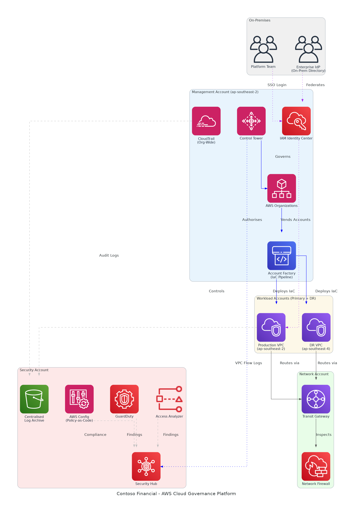

# AWS Cloud Governance Platform — Contoso Financial

## Slide Deck Structure
**11 Slides - Fixed Format**

---

### Slide 1: Title Slide
**layout:** eo_title_slide

**Presentation Title:** Solution Briefing
**Subtitle:** AWS Cloud Governance Platform — Contoso Financial
**Presenter:** [Presenter Name] | [Current Date]

---

### Slide 2: Business Opportunity
**layout:** eo_two_column

**Eliminating Audit Risk with Automated Cloud Governance**

- **Opportunity**
  - 3–4 compliance findings per quarter driving costly remediation overhead
  - Manual provisioning with shared admin credentials creates security exposure
  - Q2 2026 regulatory review demands evidence-ready automated controls
- **Success Criteria**
  - 80% reduction in remediation effort before April 2026 hard deadline
  - Zero manual console access in production with full audit trail
  - ISO 27001 controls validated and evidence collected pre-review

---

### Slide 3: Engagement Scope
**layout:** eo_table

**Sizing Parameters for This Engagement**

This engagement is sized based on the following parameters:

<!-- BEGIN SCOPE_SIZING_TABLE -->
<!-- TABLE_CONFIG: widths=[18, 29, 5, 18, 30] -->
| Parameter | Scope | | Parameter | Scope |
|-----------|-------|---|-----------|-------|
| **AWS Accounts** | Management + Security + Network + 3 Workload | | **Deployment Regions** | ap-southeast-2 (primary) + ap-southeast-4 (DR) |
| **Environments** | 3 environments (dev, staging, prod) | | **Availability Requirements** | 99.9% uptime for platform services |
| **Identity Federation** | On-premises IdP via IAM Identity Center | | **Compliance Frameworks** | ISO 27001 + internal security baseline |
| **Policy Enforcement** | AWS Config + Service Control Policies (SCPs) | | **Security Requirements** | No manual console access in production |
| **IaC Pipeline** | Account Factory for Terraform (AFT) | | **ITSM Integration** | Existing ticketing platform via Service Catalog |
| **SIEM Integration** | On-premises SIEM via CloudTrail + S3 export | | **Infrastructure Complexity** | Hub-spoke with Transit Gateway + Network Firewall |
| **Total Platform Users** | ~25 platform team + scoped developer access | | **Data Residency** | All data in-country (AU) — ap-southeast-2/4 only |
| **Log Retention** | 12-month centralised log archive (S3) | | **Change Approval** | ITSM workflow for all production changes |
<!-- END SCOPE_SIZING_TABLE -->

*Note: Changes to these parameters may require scope adjustment and additional investment.*

---

### Slide 4: Solution Overview
**layout:** eo_visual_content

**Automated AWS Cloud Governance and Landing Zone Architecture**

- **Governance & Provisioning**
  - Control Tower + AFT automates compliant account vending at scale
  - SCPs enforce no-console-access and region-lock guardrails organisation-wide
- **Security & Compliance**
  - Security Hub aggregates GuardDuty, Config and Access Analyzer findings
  - Centralised S3 log archive with 12-month retention for audit evidence
- **Network & Identity**
  - Transit Gateway hub-spoke with Network Firewall for full traffic inspection
  - On-prem IdP federation via IAM Identity Center — no shared credentials

---

### Slide 5: Implementation Approach
**layout:** eo_single_column

**Proven Foundation-First Methodology for Cloud Governance**

- **Phase 1: Foundation & Design (Weeks 1-6)**
  - Deploy Control Tower, AWS Organizations hierarchy, and core account structure
  - Configure IAM Identity Center federation with on-premises enterprise directory
  - Establish centralised logging, Security Hub, and GuardDuty organisational baselines
- **Phase 2: Guardrails & Workload Onboarding (Months 2-3)**
  - Implement SCPs, Config rules, and policy-as-code guardrails across all accounts
  - Onboard three environments via AFT pipeline with ITSM change-approval integration
  - Enable Transit Gateway hub-spoke routing with Network Firewall traffic inspection
- **Phase 3: Validation & Handover (Month 4)**
  - Execute ISO 27001 control validation and compile evidence package for audit
  - Conduct platform runbook review and knowledge transfer to Contoso platform team
  - Deliver post-implementation review and 30-day hypercare support handover

**SPEAKER NOTES:**

*Risk Mitigation:*
- Identity Risk: Federation tested in non-prod before any production directory cutover
- Timeline Risk: Phase 1 fixed 6-week scope protects the April 2026 hard deadline
- Compliance Risk: Evidence collection automated from day one of Phase 2

*Success Factors:*
- CISO sign-off on security baseline design completed by end of Week 2
- On-premises IdP team available for federation configuration workshop in Week 3
- Clear change-freeze window agreed for production ITSM integration in Month 3

*Talking Points:*
- Phase 1 delivers the governed foundation before any workloads are onboarded
- Evidence collection is built in — not a last-minute audit scramble before April
- AFT pipeline means every new account is born compliant from day one
- Phase 3 validation gives the CISO a defensible evidence package ahead of Q2 review

---

### Slide 6: Timeline & Milestones
**layout:** eo_table

**Path to Audit-Ready Cloud Governance by Q2 2026**

<!-- TABLE_CONFIG: widths=[10, 25, 15, 50] -->
| Phase No | Phase Description | Timeline | Key Deliverables |
|----------|-------------------|----------|------------------|
| Phase 1 | Foundation & Design | Weeks 1-6 | Control Tower live, IAM Identity Center federated, Security Hub and GuardDuty active |
| Phase 2 | Guardrails & Workload Onboarding | Months 2-3 | SCPs enforced, all environments onboarded via AFT, ITSM workflow integrated |
| Phase 3 | Validation & Handover | Month 4 | ISO 27001 evidence package complete, runbooks delivered, hypercare handover signed off |

**SPEAKER NOTES:**

*Quick Wins:*
- Centralised log archive active and ingesting audit events by end of Week 2
- No-console-access SCP enforced on first workload account — Month 2
- First automated compliance evidence package generated — Month 3

*Talking Points:*
- Four-month timeline is deliberately tight to protect the April 2026 regulatory deadline
- Week 2 quick win gives the CISO tangible progress before Phase 2 begins
- Automated evidence collection means audit preparation is not a crunch-time activity
- Phase 3 handover ensures Contoso owns and can operate the platform independently

---

### Slide 7: Success Stories
**layout:** eo_single_column

**Proven Cloud Governance Results Across Financial Services**

- **ASX-Listed Retail Bank (45 accounts, 2,800 employees)**
  - Challenge: 6-week manual provisioning cycle; $420K annual audit remediation
  - Solution: Control Tower, AFT pipeline, CIS Level 1 Security Hub organisation-wide
  - Result: Provisioning cut to 4 hours; 89% compliance score within 60 days
- **Regional Insurance Group (Multi-region, APRA-regulated)**
  - Challenge: Shared admin credentials in prod; failed two consecutive APRA audits
  - Solution: IAM Identity Center federation, SCPs, automated Config evidence collection
  - Result: Clean APRA audit within 90 days; zero shared-credential findings since
- **Government-Owned Finance Entity (In-country data sovereignty required)**
  - Challenge: No guardrails enforcing region lock; active data residency breach risk
  - Solution: Transit Gateway hub-spoke, region-lock SCPs, centralised S3 logging
  - Result: Full data residency compliance certified; 100% policy coverage in 8 weeks

---

### Slide 8: Our Partnership Advantage
**layout:** eo_two_column

**Why Partner with Us for AWS Cloud Governance**

- **What We Bring**
  - 12+ years delivering AWS cloud governance and security solutions in APAC
  - 60+ successful AWS Landing Zone implementations across financial services
  - AWS Advanced Consulting Partner with Security and Cloud Operations Competency
  - Certified AWS Solutions Architects specialising in Control Tower and AFT
- **Value to You**
  - Pre-built AFT modules and Config rule libraries accelerate deployment by 40%
  - Proven ISO 27001 evidence-collection framework maps controls to AWS services
  - Direct AWS APAC security specialist support through our partner network
  - Best practices from 60+ implementations prevent common misconfiguration pitfalls

---

### Slide 9: Investment Summary
**layout:** eo_table

**Total Investment & Value**

<!-- BEGIN COST_SUMMARY_TABLE -->
<!-- TABLE_CONFIG: widths=[25, 15, 15, 15, 12, 12, 15] -->
| Cost Category | Year 1 List | Year 1 Credits | Year 1 Net | Year 2 | Year 3 | 3-Year Total |
|---------------|-------------|----------------|------------|--------|--------|--------------|
| Professional Services | $250,000 | ($15,000) | $235,000 | $0 | $0 | $235,000 |
| Cloud Infrastructure | $96,000 | ($10,000) | $86,000 | $96,000 | $96,000 | $278,000 |
| Software Licenses | $18,000 | $0 | $18,000 | $18,000 | $18,000 | $54,000 |
| Support & Maintenance | $24,000 | $0 | $24,000 | $24,000 | $24,000 | $72,000 |
| **TOTAL** | **$388,000** | **($25,000)** | **$363,000** | **$138,000** | **$138,000** | **$639,000** |
<!-- END COST_SUMMARY_TABLE -->

**AWS Partner Credits (Year 1 Only):**
- AWS Partner Services Credit: $15,000 applied to architecture and governance integration
- AWS Infrastructure Consumption Credit: $10,000 for first-year Control Tower and Security Hub usage
- Total Credits Applied: $25,000 (6.4% discount through AWS Advanced Partner programme)

**SPEAKER NOTES:**

*Value Positioning:*
- Lead with credits: $25K in AWS partner credits available through our partnership
- Net Year 1 investment of $363K protects the April 2026 regulatory deadline
- 3-year TCO of $639K versus estimated $480K+ in ongoing audit remediation costs

*Credit Program Talking Points:*
- Real credits applied to actual AWS bills — not marketing collateral
- We manage all credit paperwork and application on Contoso's behalf
- High approval rate through our AWS Advanced Consulting Partner programme in APAC

*Handling Objections:*
- Can we do this ourselves? Partner credits only available through certified AWS partners
- Are credits guaranteed? Yes, subject to standard AWS partner programme approval
- When do credits apply? Consumed throughout Year 1 as services are provisioned

---

### Slide 10: Next Steps
**layout:** eo_bullet_points

**Your Path Forward**

- **Decision:** Executive approval (James Wu + CISO) for project by [specific date]
- **Kickoff:** Target project start within 30 days of approval to protect April 2026 deadline
- **Team Formation:** Identify CISO security lead, confirm Priya Nair as technical lead and Rachel Moore as PM
- **Week 1-2:** Contract finalisation, AWS account baseline assessment, and federation design workshop
- **Week 3-4:** Control Tower deployment begins; IAM Identity Center federation configuration starts

**SPEAKER NOTES:**

*Transition from Investment:*
- Now that we have covered the investment and the regulatory deadline, let us talk about getting started
- Emphasise that the April 2026 hard deadline means a delayed start is not an option
- Show that the platform foundation can be live within six weeks of kick-off

*Walking Through Next Steps:*
- Decision requires both CTO budget approval and CISO security sign-off
- Team formation can run in parallel with contract review — no sequential delay
- Federation design workshop is a hands-on session with the on-prem IdP team
- Our team is ready to begin immediately upon contract execution

*Call to Action:*
- Schedule follow-up with James Wu, Priya Nair, and the CISO to agree on start date
- Request read-only access to existing AWS accounts for baseline assessment
- Confirm on-premises IdP team availability for Week 3 federation workshop
- Set decision date aligned to procurement lead time and April 2026 deadline

---

### Slide 11: Thank You
**layout:** eo_thank_you

**Presentation Title:** Thank You
**Subtitle:** AWS Cloud Governance Platform — Contoso Financial
**Presenter:** [Presenter Name] | [Current Date]
