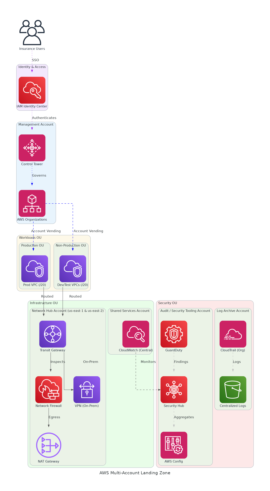

# AWS Multi-Account Landing Zone - Solution Briefing

## Slide Deck Structure
**11 Slides - Fixed Format**

---

### Slide 1: Title Slide
**layout:** eo_title_slide

**Presentation Title:** Solution Briefing
**Subtitle:** AWS Multi-Account Landing Zone
**Presenter:** [Presenter Name] | [Current Date]

---

### Slide 2: Business Opportunity
**layout:** eo_two_column

**Accelerating Cloud Adoption with a Secure AWS Foundation**

- **Opportunity**
  - Establish a greenfield multi-account AWS platform built for scale
  - Enforce security guardrails across all accounts from day one
  - Automate account vending to eliminate manual provisioning delays
- **Success Criteria**
  - 100% of accounts enrolled in Control Tower guardrails at go-live
  - New AWS account provisioning in under 30 minutes via Account Factory
  - Landing zone fully operational within 3 months of project start

---

### Slide 3: Engagement Scope
**layout:** eo_table

**Sizing Parameters for This Engagement**

This engagement is sized based on the following parameters:

<!-- BEGIN SCOPE_SIZING_TABLE -->
<!-- TABLE_CONFIG: widths=[18, 29, 5, 18, 30] -->
| Parameter | Scope | | Parameter | Scope |
|-----------|-------|---|-----------|-------|
| **AWS Accounts** | Greenfield — net-new (zero existing accounts) | | **Compliance Frameworks** | AWS Foundational Security Best Practices (FSBP) |
| **Deployment Regions** | us-east-1 (primary), us-east-2 (DR) | | **Infrastructure Complexity** | Multi-account hub-spoke with Transit Gateway |
| **OU Structure** | 6 OUs (Security, Infrastructure, Workloads, Sandbox, Suspended, Root) | | **IaC Coverage** | 95%+ Terraform (AFT for account vending) |
| **Control Tower Guardrails** | SCPs + RCPs (deny root, restrict regions, MFA, data perimeter) | | **Deployment Environments** | 3 (Development, Non-Production, Production) |
| **Network Architecture** | Hub-spoke Transit Gateway, /20 per spoke VPC | | **Availability Requirements** | Multi-region active/DR (us-east-1 + us-east-2) |
| **On-Premises Connectivity** | VPN initial (Direct Connect TBD at discovery) | | **Monitoring & Alerting** | Centralised CloudWatch + Security Hub findings |
| **Security Tooling** | GuardDuty, Security Hub, Config, CloudTrail (org trail) | | **Tagging Standards** | 5 mandatory tags (Env, Owner, CostCenter, Project, DataClass) |
| **Total Users** | TBD — stakeholder mapping at kick-off | | **Timeline** | 3 months (12 weeks) |
<!-- END SCOPE_SIZING_TABLE -->

*Note: Changes to these parameters may require scope adjustment and additional investment.*

---

### Slide 4: Solution Overview
**layout:** eo_visual_content

**Secure Multi-Account AWS Landing Zone Architecture**

- **Governance & Identity**
  - Control Tower + Organizations enforce guardrails across all accounts
  - IAM Identity Center provides centralised SSO for all AWS accounts
- **Networking**
  - Transit Gateway hub-spoke with Network Firewall for traffic inspection
  - VPN connectivity to on-premises; VPC IPAM manages IP address space
- **Security & Compliance**
  - Security Hub aggregates findings; GuardDuty detects threats in both regions
  - CloudTrail org trail and Config rules ensure audit and compliance coverage

---

### Slide 5: Implementation Approach
**layout:** eo_single_column

**Foundation-First Delivery for Zero-Risk Cloud Adoption**

- **Phase 1: Foundation & Governance (Weeks 1-4)**
  - Deploy Control Tower, OU structure, SCPs/RCPs across both regions
  - Configure IAM Identity Center SSO and centralised logging accounts
  - Establish Log Archive and Audit accounts with CloudTrail org trail
- **Phase 2: Networking & Connectivity (Weeks 5-8)**
  - Deploy Transit Gateway in us-east-1 and us-east-2 with hub VPCs
  - Configure Network Firewall, NAT Gateway, VPC IPAM, and spoke templates
  - Establish VPN to on-premises; validate east-west and north-south inspection
- **Phase 3: Security, Automation & Handover (Weeks 9-12)**
  - Enable Security Hub (FSBP), GuardDuty, Config rules, and CloudTrail Lake
  - Deploy AFT pipeline for automated account vending with tagging enforcement
  - Deliver runbooks, team onboarding, and knowledge transfer to client team

**SPEAKER NOTES:**

*Risk Mitigation:*
- Technical: Control Tower deployed first to enforce guardrails before workloads onboard
- Timeline: Greenfield environment reduces migration complexity and accelerates delivery
- Resource: AFT IaC pipeline ensures repeatable deployments without manual error

*Success Factors:*
- Stakeholder identification and RACI completion at kick-off week
- Client team available for architecture design review and sign-off in Phase 1
- On-premises connectivity details confirmed before Phase 2 network deployment

*Talking Points:*
- Foundation-first approach means every account is compliant before workloads land
- Phased delivery reduces risk while showing progress every four weeks
- AFT pipeline delivered in Phase 3 lets client self-serve new accounts by go-live
- Runbook and KT in final phase ensures client team can operate independently

---

### Slide 6: Timeline & Milestones
**layout:** eo_table

**Path to Value Realization**

<!-- TABLE_CONFIG: widths=[10, 25, 15, 50] -->
| Phase No | Phase Description | Timeline | Key Deliverables |
|----------|-------------------|----------|------------------|
| Phase 1 | Foundation & Governance | Weeks 1-4 | Control Tower live, OU structure deployed, IAM Identity Center SSO operational, Centralised logging active |
| Phase 2 | Networking & Connectivity | Weeks 5-8 | Transit Gateway hub-spoke in both regions, Network Firewall operational, VPN to on-premises established |
| Phase 3 | Security, Automation & Handover | Weeks 9-12 | Security Hub FSBP enabled, AFT account vending pipeline live, 2 workload accounts vended, Runbooks delivered |

**SPEAKER NOTES:**

*Quick Wins:*
- Control Tower guardrails and SSO live by end of Week 4 — Month 1
- Network inspection and VPN connectivity operational by end of Week 8 — Month 2
- First automated account vended via AFT by Week 11 — Month 3

*Talking Points:*
- Every four weeks delivers a major capability milestone that the client can validate
- Security guardrails are active from Week 1, reducing risk from day one
- AFT pipeline means client can provision new accounts in under 30 minutes at go-live
- Complete operational handover with runbooks by end of Month 3 as committed

---

### Slide 7: Success Stories
**layout:** eo_single_column

**Proven Results Delivering AWS Landing Zones**

- **Insurance Technology Provider (Greenfield, US-based)**
  - Challenge: No AWS presence; manual account setup causing 6-week delays
  - Solution: Control Tower, AFT, and Transit Gateway hub-spoke across two regions
  - Result: Account provisioning reduced to 20 minutes; 100% guardrail compliance at launch
- **Financial Services Firm (Multi-region, 30+ accounts)**
  - Challenge: Ad-hoc accounts with inconsistent security; failed compliance audit
  - Solution: Control Tower consolidation, SCPs, Security Hub FSBP standard enforced
  - Result: 87% Security Hub compliance score within 45 days; audit remediation closed
- **Healthcare Provider (Regulated, HIPAA-aligned)**
  - Challenge: Siloed AWS accounts, no centralised logging, 4-week provisioning lead time
  - Solution: Organizations OU redesign, CloudTrail Lake, AFT with mandatory tagging
  - Result: Provisioning cut to 25 minutes; centralised audit trail across all accounts

---

### Slide 8: Our Partnership Advantage
**layout:** eo_two_column

**Why Partner with Us for AWS Landing Zone**

- **What We Bring**
  - 10+ years delivering AWS cloud foundation and governance solutions
  - 60+ AWS Landing Zone and Control Tower deployments across industries
  - AWS Advanced Consulting Partner with Security and Cloud Operations competencies
  - Certified AWS Solutions Architects and Control Tower specialists on every engagement
- **Value to You**
  - Pre-built AFT modules and Terraform templates reduce delivery time by 40%
  - Proven OU and SCP design patterns eliminate costly re-architecture later
  - Direct AWS specialist support through partner network during your engagement
  - Best practices from 60+ implementations help avoid common configuration pitfalls

---

### Slide 9: Investment Summary
**layout:** eo_table

**Total Investment & Value**

<!-- BEGIN COST_SUMMARY_TABLE -->
<!-- TABLE_CONFIG: widths=[25, 15, 15, 15, 12, 12, 15] -->
| Cost Category | Year 1 List | Year 1 Credits | Year 1 Net | Year 2 | Year 3 | 3-Year Total |
|---------------|-------------|----------------|------------|--------|--------|--------------|
| Professional Services | $98,000 | ($10,000) | $88,000 | $0 | $0 | $88,000 |
| Cloud Infrastructure | $18,500 | ($5,000) | $13,500 | $18,500 | $18,500 | $50,500 |
| Support & Maintenance | $4,800 | $0 | $4,800 | $4,800 | $4,800 | $14,400 |
| **TOTAL** | **$121,300** | **($15,000)** | **$106,300** | **$23,300** | **$23,300** | **$152,900** |
<!-- END COST_SUMMARY_TABLE -->

**AWS Partner Credits (Year 1 Only):**
- AWS Partner Services Credit: $10,000 applied to architecture design and implementation
- AWS Cloud Foundation Credit: $5,000 for Security Hub, GuardDuty, and Config first-year usage
- Total Credits Applied: $15,000 (12% discount through AWS Advanced Consulting Partnership)

**SPEAKER NOTES:**

*Value Positioning:*
- Lead with credits: You qualify for $15K in AWS partner credits through our partnership
- Net Year 1 investment of $106K after partner credits for a fully operational landing zone
- 3-year TCO of $153K compared to estimated $300K+ cost of unplanned re-architecture later

*Credit Program Talking Points:*
- Real credits applied directly to your AWS bills, not marketing or promotional tokens
- We manage all credit paperwork and submission through our AWS partner portal
- High approval rate given our AWS Advanced Consulting Partner status

*Handling Objections:*
- Can we do this ourselves? AWS partner credits are only available through certified partners like us
- Are credits guaranteed? Yes, subject to standard AWS partner program terms and approval
- When do credits apply? Credits are applied throughout Year 1 as services are consumed

---

### Slide 10: Next Steps
**layout:** eo_bullet_points

**Your Path Forward**

- **Decision:** Executive approval for project by [specific date]
- **Kickoff:** Target project start date within 30 days of approval
- **Team Formation:** Identify executive sponsor, cloud/infrastructure owner, security lead, and FinOps contact
- **Week 1-2:** Contract finalization, AWS account setup, and kick-off workshop with RACI completion
- **Week 3-4:** OU design and SCP policy review, Control Tower deployment begins, architecture sign-off

**SPEAKER NOTES:**

*Transition from Investment:*
- Now that we have covered the investment and proven ROI, let us talk about getting started
- Emphasize structured foundation-first approach eliminates costly re-architecture down the line
- We can have Control Tower guardrails live within 30 days of project start

*Walking Through Next Steps:*
- Decision needed to move forward with the full landing zone implementation
- Stakeholder identification at kick-off is critical to RACI and governance decisions
- Architecture design review in Weeks 3-4 ensures alignment before infrastructure is deployed
- Our team is fully resourced and ready to begin immediately upon approval

*Call to Action:*
- Schedule follow-up meeting to confirm stakeholder list and kick-off date
- Request preliminary OU and networking topology inputs from client infrastructure team
- Confirm compliance framework requirements (NIST, SOC 2, HIPAA) with security lead
- Set timeline for contract signing and project kick-off within 30 days

---

### Slide 11: Thank You
**layout:** eo_thank_you

**Presentation Title:** Thank You
**Subtitle:** AWS Multi-Account Landing Zone — Questions & Discussion
**Presenter:** [Presenter Name] | [Current Date]
