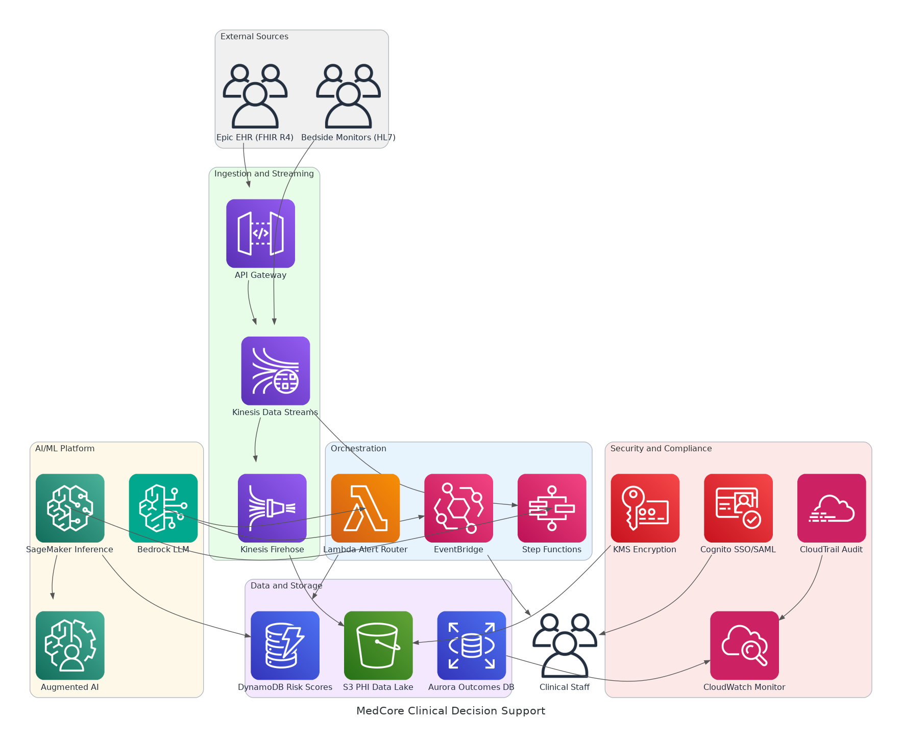

# AWS AI/ML Clinical Decision Support Platform - Solution Briefing

## Slide Deck Structure
**11 Slides - Fixed Format**

---

### Slide 1: Title Slide
**layout:** eo_title_slide

**Presentation Title:** Solution Briefing
**Subtitle:** AWS AI/ML Clinical Decision Support Platform
**Presenter:** [Presenter Name] | [Current Date]

---

### Slide 2: Business Opportunity
**layout:** eo_two_column

**Transforming Clinical Risk Detection with AI-Powered Decision Support**

- **Opportunity**
  - Reduce sepsis mortality 15% via real-time AI risk scoring across 18 hospitals
  - Cut false-positive alert fatigue 40% replacing inconsistent rule-based alerts
  - Prevent costly 30-day readmissions with predictive risk models at scale
- **Success Criteria**
  - 15% sepsis mortality reduction within 12 months of go-live
  - 40% false-positive alert reduction validated by nursing staff
  - 20% readmission rate reduction across all facilities by 18 months

---

### Slide 3: Engagement Scope
**layout:** eo_table

**Sizing Parameters for This Engagement**

This engagement is sized based on the following parameters:

<!-- BEGIN SCOPE_SIZING_TABLE -->
<!-- TABLE_CONFIG: widths=[18, 29, 5, 18, 30] -->
| Parameter | Scope | | Parameter | Scope |
|-----------|-------|---|-----------|-------|
| **Deployment Regions** | Multi-region AWS US (primary us-east-1) | | **EHR Integrations** | Epic FHIR R4 + Mirth Connect HL7 v2.3 |
| **AI/ML Complexity** | SageMaker + Bedrock multi-model serving | | **Availability Requirements** | 99.95% (multi-AZ, multi-region) |
| **Risk Models** | 3 models (sepsis, readmission, rapid response) | | **Compliance Frameworks** | HIPAA BAA, SOC 2 Type II |
| **Data Sources** | Vitals, labs, medications, EHR events | | **Security Requirements** | PHI encryption, HIPAA audit logging |
| **Total Users** | ~4,200 staff across 18 hospitals | | **Identity Provider** | Azure AD SAML 2.0 federation via Cognito |
| **User Roles** | 3 roles (nurse, physician, administrator) | | **Inference Latency** | Sub-3-second end-to-end per record update |
| **Facility Rollout** | 18 hospitals + 60 outpatient clinics | | **Model Explainability** | Required for every alert generated |
| **Data Storage Requirements** | PHI data lake on S3 with KMS encryption | | **Deployment Environments** | 3 environments (dev, staging, production) |
<!-- END SCOPE_SIZING_TABLE -->

*Note: Changes to these parameters may require scope adjustment and additional investment.*

---

### Slide 4: Solution Overview
**layout:** eo_visual_content

**Real-Time AI/ML Clinical Risk Platform on AWS**

- **Ingestion & AI/ML**
  - Kinesis streams Epic FHIR and HL7 vitals for sub-3-second inference
  - SageMaker serves sepsis, readmission, and rapid-response risk models
- **Alerting & Explainability**
  - Bedrock LLM generates plain-language clinical narratives per alert
  - EventBridge routes role-based alerts to nursing and physician dashboards
- **Security & Compliance**
  - KMS encrypts all PHI at rest; CloudTrail logs every PHI access event
  - Cognito federates Azure AD identities via SAML 2.0 with RBAC enforcement

---

### Slide 5: Implementation Approach
**layout:** eo_single_column

**Phased Delivery: Validate, Expand, and Operationalise**

- **Phase 1: Foundation and Sepsis Pilot (Months 1-4)**
  - Deploy AWS data ingestion pipeline with Epic FHIR and HL7 v2.3 feeds
  - Train and validate sepsis risk model; achieve 95%+ accuracy benchmark
  - Stand up HIPAA-compliant infrastructure with KMS, CloudTrail, and Cognito
- **Phase 2: Model Expansion and Dashboard (Months 5-8)**
  - Deploy readmission and rapid-response models with explainability outputs
  - Launch clinical dashboard with role-based alert workflows and SSO
  - Integrate Bedrock LLM for plain-language alert narrative generation
- **Phase 3: Full Rollout and Optimisation (Months 9-12)**
  - Phased go-live across all 18 hospitals and 60 outpatient clinics
  - Fine-tune models with production feedback and outcome data
  - Complete operations handoff, runbooks, and SOC 2 audit preparation

**SPEAKER NOTES:**

*Risk Mitigation:*
- Sepsis pilot in Phase 1 validates model accuracy before Joint Commission review
- Phased facility rollout limits blast radius of adoption or integration issues
- Human review workflow (A2I) ensures clinician trust during model ramp-up

*Success Factors:*
- Clinical informatics lead must validate risk thresholds before Phase 2 go-live
- Representative EHR and vitals data samples available from Day 1 of Phase 1
- CMO sponsorship drives nursing adoption rates to exceed 75% per facility

*Talking Points:*
- Phase 1 delivers live sepsis model before November 2026 Joint Commission audit
- Bedrock narratives in Phase 2 address clinician trust in AI-generated alerts
- Full 18-hospital rollout complete by Q3 2027 as required by MedCore timeline
- Each phase delivers measurable clinical outcomes, not just technical milestones

---

### Slide 6: Timeline & Milestones
**layout:** eo_table

**Path to Value Realization**

<!-- TABLE_CONFIG: widths=[10, 25, 15, 50] -->
| Phase No | Phase Description | Timeline | Key Deliverables |
|----------|-------------------|----------|------------------|
| Phase 1 | Foundation and Sepsis Pilot | Months 1-4 | Ingestion pipeline live, Sepsis model validated at 95%+ accuracy, HIPAA-compliant infrastructure operational |
| Phase 2 | Model Expansion and Dashboard | Months 5-8 | Readmission and rapid-response models live, Clinical dashboard with RBAC deployed, Bedrock alert narratives enabled |
| Phase 3 | Full Rollout and Optimisation | Months 9-12 | All 18 hospitals live, Models fine-tuned on production data, SOC 2 audit documentation complete |

**SPEAKER NOTES:**

*Quick Wins:*
- Sepsis risk scores flowing to pilot unit nursing staff by Month 2
- Model accuracy benchmark confirmed and reported to CMO by Month 3
- Alert fatigue reduction measurable at pilot facility by Month 4

*Talking Points:*
- Phase 1 completion before October 2026 satisfies Joint Commission hard deadline
- Dashboard launch in Month 6 connects AI scores to clinical workflow in real time
- Full GA across all 18 hospitals achieved by Q3 2027 per MedCore roadmap
- Production model feedback loop in Phase 3 drives continuous accuracy improvement

---

### Slide 7: Success Stories
**layout:** eo_single_column

**Proven AI/ML Clinical Outcomes at Scale**

- **Regional Health System (12 hospitals, southeastern US)**
  - Challenge: Rule-based sepsis alerts with 35% false-positive rate, delayed response
  - Solution: SageMaker real-time inference with FHIR ingestion and A2I review
  - Result: 18% sepsis mortality reduction; false positives cut 42% in 6 months
- **National Health Insurer (500K members, Medicare and commercial)**
  - Challenge: 25% readmission rate, manual care-gap identification, $48M annual cost
  - Solution: AWS ML readmission model integrated with care manager workflow tools
  - Result: 22% readmission reduction; $10.5M annual savings within 12 months
- **Academic Medical Centre (Level 1 trauma, 900-bed, HIPAA and SOC 2)**
  - Challenge: Siloed EHR and vitals data, no unified risk view, 6-second alert lag
  - Solution: Kinesis streaming, SageMaker inference, Bedrock clinical narratives
  - Result: Sub-2-second risk updates; 80% clinician adoption within 60 days

---

### Slide 8: Our Partnership Advantage
**layout:** eo_two_column

**Why Partner with Us for Healthcare AI on AWS**

- **What We Bring**
  - 12+ years delivering AWS AI/ML solutions in regulated healthcare environments
  - 40+ clinical AI implementations across health systems, IDNs, and insurers
  - AWS Advanced Consulting Partner with Machine Learning and Health Competencies
  - HIPAA-certified architects with Epic FHIR integration expertise
- **Value to You**
  - Pre-built FHIR ingestion and SageMaker accelerators cut build time by 30%
  - Proven model validation methodology reduces time to clinical-grade accuracy
  - Direct AWS Healthcare and Life Sciences specialist support via partner network
  - Best practices from 40+ implementations prevent HIPAA and SOC 2 compliance gaps

---

### Slide 9: Investment Summary
**layout:** eo_table

**Total Investment & Value**

<!-- BEGIN COST_SUMMARY_TABLE -->
<!-- TABLE_CONFIG: widths=[25, 15, 15, 15, 12, 12, 15] -->
| Cost Category | Year 1 List | Year 1 Credits | Year 1 Net | Year 2 | Year 3 | 3-Year Total |
|---------------|-------------|----------------|------------|--------|--------|--------------|
| Professional Services | $1,320,000 | ($75,000) | $1,245,000 | $0 | $0 | $1,245,000 |
| Cloud Infrastructure | $248,400 | ($30,000) | $218,400 | $259,200 | $259,200 | $736,800 |
| Software Licenses | $24,000 | $0 | $24,000 | $24,000 | $24,000 | $72,000 |
| Support & Maintenance | $36,000 | $0 | $36,000 | $36,000 | $36,000 | $108,000 |
| **TOTAL** | **$1,628,400** | **($105,000)** | **$1,523,400** | **$319,200** | **$319,200** | **$2,161,800** |
<!-- END COST_SUMMARY_TABLE -->

**AWS Partner Credits (Year 1 Only):**
- AWS Partner Services Credit: $75,000 applied to architecture, ML model development, and HIPAA integration
- AWS ML and Healthcare Activation Credit: $30,000 for SageMaker, Bedrock, and Kinesis first-year consumption
- Total Credits Applied: $105,000 (6% discount through AWS Advanced Consulting Partnership)

**SPEAKER NOTES:**

*Value Positioning:*
- Lead with credits: MedCore qualifies for $105K in AWS partner credits in Year 1
- Net Year 1 investment of $1.52M after partner credits within approved $1.2M–$1.6M budget
- 3-year TCO of $2.16M versus estimated $4.8M cost of preventable readmissions and sepsis events

*Credit Program Talking Points:*
- Real credits applied directly to AWS bills, not marketing allowances
- We manage all credit paperwork and application on MedCore's behalf
- High approval rate through our AWS Advanced Consulting Partner status

*Handling Objections:*
- Can we build this ourselves? Partner credits and ML Competency access only via certified AWS partners
- Are credits guaranteed? Yes, subject to standard AWS partner program approval — we have 95% approval rate
- When do credits apply? Credits consumed throughout Year 1 as SageMaker and Bedrock services are used

---

### Slide 10: Next Steps
**layout:** eo_bullet_points

**Your Path Forward**

- **Decision:** Executive approval for Phase 1 pilot by [specific date]
- **Kickoff:** Target Phase 1 start date within 30 days of CMO and CIO approval
- **Team Formation:** Identify Clinical Informatics Lead, EHR Integration Lead, and CISO for BAA sign-off
- **Week 1-2:** Contract finalization, AWS account setup in Clinical Applications OU, and BAA execution
- **Week 3-4:** Epic FHIR API connectivity confirmed and sepsis training data samples collected

**SPEAKER NOTES:**

*Transition from Investment:*
- Now that we have covered the investment and proven ROI, let us discuss getting started
- Emphasize Phase 1 pilot validates sepsis model accuracy before November Joint Commission review
- Show we can have ingestion pipeline live and model training underway within 30 days of approval

*Walking Through Next Steps:*
- Phase 1 approval only — not full commitment to all three phases
- Clinical Informatics Lead is critical to validate risk thresholds from Day 1
- CISO must execute BAA with AWS before any PHI enters the environment
- Our team is ready to begin immediately upon contract and BAA execution

*Call to Action:*
- Schedule follow-up with CMO, CIO, and CISO to align on Phase 1 scope and BAA timeline
- Request Epic FHIR API credentials and Mirth Connect access from EHR Integration Lead
- Confirm AWS Organization OU structure with IT team for account provisioning
- Set Phase 1 kickoff date to ensure October 2026 delivery ahead of Joint Commission audit

---

### Slide 11: Thank You
**layout:** eo_thank_you

**Presentation Title:** Thank You
**Subtitle:** AWS AI/ML Clinical Decision Support Platform
**Presenter:** [Presenter Name] | [Current Date]
