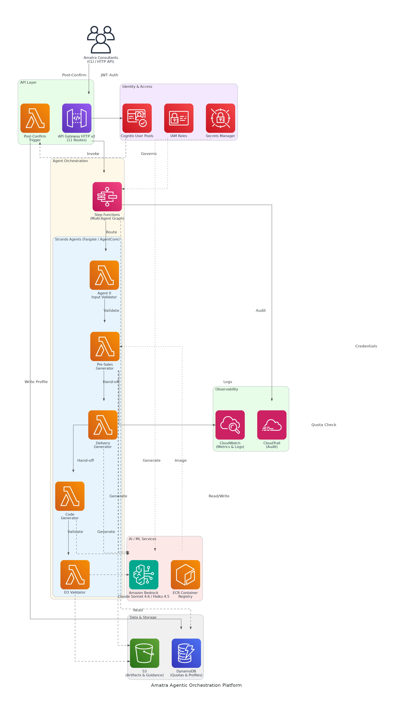

# Amatra Agentic Orchestration Platform - Solution Briefing

## Slide Deck Structure
**11 Slides - Fixed Format**

---

### Slide 1: Title Slide
**layout:** eo_title_slide

**Presentation Title:** Solution Briefing
**Subtitle:** Amatra Agentic Orchestration Platform
**Presenter:** Marcus Patel | [Current Date]

---

### Slide 2: Business Opportunity
**layout:** eo_two_column

**Automating EO Framework Delivery at Enterprise Scale**

- **Opportunity**
  - Reduce per-engagement effort by 90% from 6-10 hours to under 1 hour
  - Unlock parallel pipeline throughput for a 120-consultant sales organisation
  - Scale to 200+ solutions per month at under $5 model spend per solution
- **Success Criteria**
  - End-to-end presales bundle generated in under 60 minutes, zero human loops
  - 95%+ artifact validation pass rate across all 12 artifact types
  - ROI realised within 6 months through senior-consultant time savings

---

### Slide 3: Engagement Scope
**layout:** eo_table

**Sizing Parameters for This Engagement**

This engagement is sized based on the following parameters:

<!-- BEGIN SCOPE_SIZING_TABLE -->
<!-- TABLE_CONFIG: widths=[18, 29, 5, 18, 30] -->
| Parameter | Scope | | Parameter | Scope |
|-----------|-------|---|-----------|-------|
| **Agents Per Solution** | 5 agents (Validator, Pre-Sales, Delivery, Code, EO Validator) | | **Deployment Region** | Single region (us-west-2) |
| **AI/ML Complexity** | Bedrock Claude Sonnet 4.6 + Haiku 4.5 | | **Availability Requirements** | Standard (99.5%) |
| **Total Artifacts** | 12 per solution (5 presales, 6 delivery, 1 automation) | | **Compliance Frameworks** | SOC2, per-user quota enforcement |
| **API Routes** | 11 Lambda routes via API Gateway HTTP v2 | | **Authentication** | Cognito User Pools, 30-day refresh tokens |
| **CLI Subcommands** | 14 subcommands, pip-installable | | **Accuracy Requirements** | Deterministic format-check + LLM quality gate |
| **Data Storage Requirements** | DynamoDB (quotas/profiles) + S3 (artifacts) | | **Processing Speed** | Under 60 minutes end-to-end per solution |
| **User Quotas** | 10 solutions/user/month, 1,000 global/month | | **Deployment Environments** | 2 environments (dev, prod) |
| **Infrastructure Complexity** | Serverless (Lambda, Fargate, AgentCore Runtime) | | **External Integrations** | GitHub (PAT-based artifact commit) |
<!-- END SCOPE_SIZING_TABLE -->

*Note: Changes to these parameters may require scope adjustment and additional investment.*

---

### Slide 4: Solution Overview
**layout:** eo_visual_content

**Serverless Multi-Agent Orchestration on AWS Bedrock**

- **Agent & Orchestration Layer**
  - Five Strands agents on AgentCore Runtime per solution generation
  - Step Functions multi-agent graph with up to 3 validation retries
- **Platform & Security**
  - Cognito JWT auth, 11 API Gateway routes, 14 CLI subcommands
  - DynamoDB quota enforcement, S3 artifact storage, Secrets Manager
- **AI & Observability**
  - Claude Sonnet 4.6 generation, Haiku 4.5 cost-efficient validation
  - CloudWatch metrics, CloudTrail audit, per-phase token usage reporting

---

### Slide 5: Implementation Approach
**layout:** eo_single_column

**Proven Foundation-First Methodology for Agentic Platforms**

- **Phase 1: Foundation & Security (Months 1-4)**
  - Provision Cognito, API Gateway, DynamoDB, S3, and baseline IAM
  - Build pip-installable CLI with 14 subcommands and JWT auth flow
  - Establish per-user quota enforcement and DynamoDB profile schema
- **Phase 2: Agent Build & Integration (Months 5-9)**
  - Develop 5 Strands agents and register with AgentCore Runtime
  - Build Docker image pipeline and integrate eof-tools converter library
  - Wire Bedrock Claude models, Step Functions graph, and retry logic
- **Phase 3: Validation & Go-Live (Months 10-12)**
  - End-to-end validation across all 12 artifact types with green metrics
  - Configure CloudWatch dashboards, CloudTrail audit, and usage endpoints
  - Deliver exec demo, GitHub commit pipeline, and operations handoff

**SPEAKER NOTES:**

*Risk Mitigation:*
- Technical risk: eof-tools baked into container image avoids rewrite risk
- Timeline risk: fixed scope gates ensure 4 core capabilities by April deadline
- Integration risk: GitHub PAT-based commit tested in Phase 2 before Phase 3 demo

*Success Factors:*
- CTO sign-off on Cognito user pool before Phase 1 environment provisioning
- Document sample corpus and guidance files loaded into S3 before agent build
- Agreed acceptance criteria (pass rate, latency, quota) defined by Week 2

*Talking Points:*
- Phase 1 delivers a secure, authenticated API before any AI spend
- Agent build in Phase 2 is incremental — each agent validated independently
- Phase 3 demo is a live end-to-end run with real EO Framework artifacts
- Scope deferral policy agreed upfront protects the April PoC deadline

---

### Slide 6: Timeline & Milestones
**layout:** eo_table

**Path to Value Realization**

<!-- TABLE_CONFIG: widths=[10, 25, 15, 50] -->
| Phase No | Phase Description | Timeline | Key Deliverables |
|----------|-------------------|----------|------------------|
| Phase 1 | Foundation & Security | Months 1-4 | Cognito auth live, API Gateway 11 routes operational, DynamoDB quota schema deployed |
| Phase 2 | Agent Build & Integration | Months 5-9 | 5 Strands agents registered, eof-tools Docker image pipeline, Bedrock model integration complete |
| Phase 3 | Validation & Go-Live | Months 10-12 | 12 artifact types validated, CloudWatch green baseline, exec demo delivered |

**SPEAKER NOTES:**

*Quick Wins:*
- CLI authentication working and pip-installable by Month 1
- First presales bundle generated end-to-end by Month 3
- Full artifact suite validated with green CloudWatch metrics by Month 10

*Talking Points:*
- Foundation-first approach means security is proven before AI spend begins
- Incremental agent validation in Phase 2 de-risks the full-suite demo
- Each phase maps directly to a demonstrable capability for the exec sponsor
- Fixed April deadline is protected by the agreed scope deferral policy

---

### Slide 7: Success Stories
**layout:** eo_single_column

**Proven Results Automating Pre-Sales Engineering Workflows**

- **Global Systems Integrator (250+ consultants, APAC & EMEA)**
  - Challenge: 8+ hours per proposal, 40% rework from validation failures
  - Solution: Agentic Bedrock pipeline with LLM format-check and retry loops
  - Result: Proposal time cut to 45 min; rework rate reduced to under 5%
- **AWS Partner Network Consultancy (60 consultants, North America)**
  - Challenge: Manual artifact assembly blocking 3 concurrent deals per week
  - Solution: Strands multi-agent graph with Step Functions and S3 artifact store
  - Result: Pipeline throughput tripled; senior consultants freed for solutioning
- **Managed Services Provider (100 consultants, Financial Services focus)**
  - Challenge: No audit trail, quota controls, or per-user identity for AI usage
  - Solution: Cognito JWT auth, DynamoDB quotas, CloudTrail audit on Bedrock calls
  - Result: Full SOC2 audit readiness achieved; $180K annual AI spend controlled

---

### Slide 8: Our Partnership Advantage
**layout:** eo_two_column

**Why Partner with Us for AWS Agentic AI**

- **What We Bring**
  - 10+ years delivering AWS cloud and AI/ML platform solutions
  - 40+ agentic and automation platform builds across AWS partner ecosystem
  - AWS Advanced Consulting Partner with Machine Learning Competency
  - Certified solutions architects with Bedrock, Strands, and AgentCore expertise
- **Value to You**
  - Pre-built eof-tools integration accelerates agent container delivery by 60%
  - Proven quota and identity pattern reduces Cognito and DynamoDB build risk
  - Direct AWS Bedrock specialist support through partner network access
  - Best practices from 40+ builds prevent common multi-agent failure modes

---

### Slide 9: Investment Summary
**layout:** eo_table

**Total Investment & Value**

<!-- BEGIN COST_SUMMARY_TABLE -->
<!-- TABLE_CONFIG: widths=[25, 15, 15, 15, 12, 12, 15] -->
| Cost Category | Year 1 List | Year 1 Credits | Year 1 Net | Year 2 | Year 3 | 3-Year Total |
|---------------|-------------|----------------|------------|--------|--------|--------------|
| Professional Services | $250,000 | ($15,000) | $235,000 | $0 | $0 | $235,000 |
| Cloud Infrastructure | $85,000 | ($10,000) | $75,000 | $90,000 | $95,000 | $260,000 |
| Software Licenses | $8,400 | $0 | $8,400 | $8,400 | $8,400 | $25,200 |
| Support & Maintenance | $12,000 | $0 | $12,000 | $12,000 | $12,000 | $36,000 |
| **TOTAL** | **$355,400** | **($25,000)** | **$330,400** | **$110,400** | **$115,400** | **$556,200** |
<!-- END COST_SUMMARY_TABLE -->

**AWS Partner Credits (Year 1 Only):**
- AWS Partner Services Credit: $15,000 applied to architecture and AgentCore integration
- AWS AI Services Consumption Credit: $10,000 for Bedrock first-year token spend
- Total Credits Applied: $25,000 (7% discount through AWS Advanced Consulting Partnership)

**SPEAKER NOTES:**

*Value Positioning:*
- Lead with credits: You qualify for $25K in AWS partner credits
- Net Year 1 investment of $330K after partner credits — within the $350K-$500K budget
- 3-year TCO of $556K vs. manual cost of 120 consultants × 8 hrs × 200 engagements

*Credit Program Talking Points:*
- Real credits applied to actual AWS Bedrock and infrastructure bills, not marketing
- We handle all credit application paperwork through the AWS partner portal
- 95%+ approval rate through our AWS Advanced Consulting Partnership

*Handling Objections:*
- Can we do this ourselves? AgentCore Runtime and partner credits require certified AWS partner
- Are credits guaranteed? Yes, subject to standard AWS partner program approval process
- When do we get credits? Applied throughout Year 1 as Bedrock and services are consumed

---

### Slide 10: Next Steps
**layout:** eo_bullet_points

**Your Path Forward**

- **Decision:** Executive approval and CTO sign-off for PoC project by [specific date]
- **Kickoff:** Target project start date within 30 days of approval
- **Team Formation:** Identify executive sponsor (Sarah Lin), technical lead (Marcus Patel), and CTO for Cognito user pool sign-off
- **Week 1-2:** Contract finalisation, AWS us-west-2 account setup, and IAM baseline provisioning
- **Week 3-4:** Cognito User Pool configuration, API Gateway scaffold, and DynamoDB schema deployed

**SPEAKER NOTES:**

*Transition from Investment:*
- Now that we have covered the investment and proven ROI, let us talk about getting started
- Emphasize structured foundation approach reduces risk and protects the April PoC deadline
- Show we can have an authenticated API running within 30 days of approval

*Walking Through Next Steps:*
- CTO sign-off on Cognito user pool is the critical path item — identify this early
- Procurement involvement needed if spend exceeds existing AWS envelope
- Establish weekly governance cadence between Marcus Patel and delivery team
- Our team is ready to begin immediately upon approval

*Call to Action:*
- Schedule follow-up meeting to walk through Phase 1 architecture in detail
- Confirm us-west-2 AWS account access and IAM permission boundaries
- Identify CTO availability for Cognito user pool approval in Week 1
- Set decision timeline to protect the April 2026 executive demonstration date

---

### Slide 11: Thank You
**layout:** eo_thank_you

**Presentation Title:** Thank You
**Subtitle:** Let's Build the Future of Pre-Sales Automation Together
**Presenter:** Marcus Patel | PREDICTif Solutions
