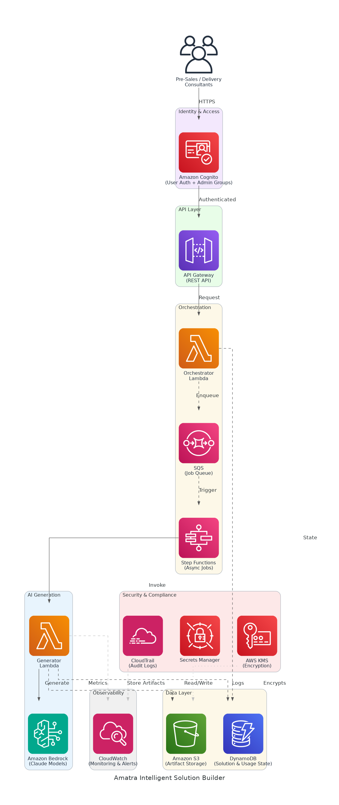

# Amatra Intelligent Solution Builder - Solution Briefing

## Slide Deck Structure
**11 Slides - Fixed Format**

---

### Slide 1: Title Slide
**layout:** eo_title_slide

**Presentation Title:** Solution Briefing
**Subtitle:** Amatra Intelligent Solution Builder
**Presenter:** [Presenter Name] | [Current Date]

---

### Slide 2: Business Opportunity
**layout:** eo_two_column

**Accelerating Pre-Sales Velocity with AI-Powered Automation**

- **Opportunity**
  - Reduce artifact turnaround from 3 weeks to under 2 business days
  - Triple proposal throughput from 8 to 24 active engagements per quarter
  - Cut consulting hours per engagement by 40% with automated generation
- **Success Criteria**
  - 90% of generated artifacts pass internal QA on first review
  - Platform available at 99.9% uptime in production (us-west-2)
  - Full ROI realised within 12 months through increased proposal volume

---

### Slide 3: Engagement Scope
**layout:** eo_table

**Sizing Parameters for This Engagement**

This engagement is sized based on the following parameters:

<!-- BEGIN SCOPE_SIZING_TABLE -->
<!-- TABLE_CONFIG: widths=[18, 29, 5, 18, 30] -->
| Parameter | Scope | | Parameter | Scope |
|-----------|-------|---|-----------|-------|
| **AI/ML Complexity** | Amazon Bedrock Claude models | | **Deployment Environments** | 2 environments (dev, prod) |
| **Artifact Types** | 7 artifact types per engagement | | **Compliance Frameworks** | SOC 2 Type II, GDPR-aligned |
| **Document Processing Volume** | ~24 engagements/quarter | | **Availability Requirements** | 99.9% (us-west-2) |
| **Async Job Duration** | 30–60 min generation jobs | | **Security Requirements** | Cognito auth, KMS encryption |
| **Total Users** | ~120 internal users (Amatra) | | **Data Residency** | United States only |
| **User Roles** | 3 roles (pre-sales, delivery, admin) | | **Identity Migration** | Okta → Amazon Cognito |
| **Data Storage Requirements** | S3 artifact store + DynamoDB state | | **Usage Controls** | Per-user and global monthly limits |
| **External Integrations** | Legacy monolith retirement (EC2) | | **Infrastructure Complexity** | Serverless (Lambda, SQS, Step Functions) |
<!-- END SCOPE_SIZING_TABLE -->

*Note: Changes to these parameters may require scope adjustment and additional investment.*

---

### Slide 4: Solution Overview
**layout:** eo_visual_content

**Serverless AI-Powered Artifact Generation Platform on AWS**

- **AI Generation Layer**
  - Amazon Bedrock (Claude) powers consulting-grade artifact generation
  - Async Step Functions + SQS handle 30–60 min jobs reliably
- **Platform & Data**
  - Lambda + API Gateway deliver a secure, scalable REST API
  - DynamoDB tracks solution state; S3 stores all generated artifacts
- **Security & Compliance**
  - Cognito manages auth with admin groups and usage-limit enforcement
  - KMS encryption and CloudTrail audit logs support SOC 2 Type II

---

### Slide 5: Implementation Approach
**layout:** eo_single_column

**Phased Delivery: MVP, Automation, and General Availability**

- **Phase 1: Foundation & Pre-Sales MVP (Months 1-4)**
  - Establish AWS environment, Cognito identity migration from Okta
  - Build Bedrock generation pipeline for 7 pre-sales artifact types
  - Deliver working MVP with QA validation by 2026-09-30
- **Phase 2: Delivery & Terraform Automation (Months 5-7)**
  - Extend platform to delivery artifact and Terraform automation phases
  - Integrate legacy artifact templates (Word/Excel/PowerPoint pipelines)
  - Complete end-to-end testing and internal rollout by 2026-12-15
- **Phase 3: Optimisation & General Availability (Months 8-9)**
  - Tune Bedrock prompts based on QA first-pass rates and user feedback
  - Activate admin usage controls, monitoring dashboards, and alerts
  - General Availability to all ~120 internal users by Q1 2027

**SPEAKER NOTES:**

*Risk Mitigation:*
- Technical: Async job architecture prevents Lambda timeouts on long generation
- Timeline: MVP-first approach validates Bedrock output quality early in Phase 1
- Resource: Cognito migration de-risked in Phase 1 before delivery users onboard

*Success Factors:*
- Head of Solutions engaged early to validate artifact templates and QA standards
- Representative client briefs available to calibrate Bedrock prompt quality
- Security & Compliance Lead signs off on SOC 2 controls before GA

*Talking Points:*
- Phase 1 MVP delivers business value by the Q3 2026 hard deadline
- Phased expansion reduces risk by proving AI quality before full rollout
- Built-in admin governance ensures usage limits protect cost and quality
- GA before the 2027-01-31 flagship renewal secures the client relationship

---

### Slide 6: Timeline & Milestones
**layout:** eo_table

**Path to Value Realization**

<!-- TABLE_CONFIG: widths=[10, 25, 15, 50] -->
| Phase No | Phase Description | Timeline | Key Deliverables |
|----------|-------------------|----------|------------------|
| Phase 1 | Foundation & Pre-Sales MVP | Months 1-4 | AWS environment live, Cognito identity migration complete, Pre-sales generation MVP operational (by 2026-09-30) |
| Phase 2 | Delivery & Terraform Automation | Months 5-7 | Delivery artifacts automated, Terraform pipeline integrated, Legacy templates migrated (by 2026-12-15) |
| Phase 3 | Optimisation & General Availability | Months 8-9 | Prompt tuning complete, Admin controls active, Full GA to all users (Q1 2027) |

**SPEAKER NOTES:**

*Quick Wins:*
- First AI-generated pre-sales artifact demonstrated — Month 2
- Cognito auth and usage controls operational — Month 3
- Pre-sales MVP live and processing real briefs — Month 4

*Talking Points:*
- Phase 1 MVP delivers measurable time savings before Phase 2 begins
- Phased approach validates AI quality with pre-sales before delivery rollout
- Full GA achieved before the 2027-01-31 flagship client renewal deadline
- Each phase ends with a concrete, testable business outcome

---

### Slide 7: Success Stories
**layout:** eo_single_column

**Proven Results Automating Consulting Delivery**

- **Mid-Market Cloud Consultancy (50 consultants, AWS-focused)**
  - Challenge: 4-week proposal cycle limiting to 6 engagements per quarter
  - Solution: Bedrock-powered generation with S3 + DynamoDB artifact store
  - Result: Turnaround cut to 3 days; throughput grew 3x in 90 days
- **B2B SaaS Professional Services Firm (100 employees, North America)**
  - Challenge: Manual SOW creation taking 12 hours per engagement, high rework
  - Solution: Serverless Lambda pipeline with Bedrock Claude for SOW generation
  - Result: 85% reduction in drafting time; QA first-pass rate reached 92%
- **Enterprise IT Reseller (Pre-Sales Team of 20, multi-vendor)**
  - Challenge: Inconsistent artifact quality causing 30% proposal loss rate
  - Solution: Standardised AI generation with template-driven quality controls
  - Result: Proposal win rate up 22%; consulting hours per deal cut by 38%

---

### Slide 8: Our Partnership Advantage
**layout:** eo_two_column

**Why Partner with Us for AWS Serverless AI Delivery**

- **What We Bring**
  - 10+ years delivering AWS serverless and AI/ML solutions at scale
  - 60+ successful automation platform builds across consulting verticals
  - AWS Advanced Consulting Partner with Machine Learning Competency
  - Certified solutions architects with Bedrock and Step Functions expertise
- **Value to You**
  - Pre-built Bedrock prompt library fast-tracks artifact generation quality
  - Proven async job architecture eliminates timeout risk on long-running jobs
  - Direct AWS ML specialist support through Advanced Partner network
  - Best practices from 60+ builds prevent common serverless pitfalls

---

### Slide 9: Investment Summary
**layout:** eo_table

**Total Investment & Value**

<!-- BEGIN COST_SUMMARY_TABLE -->
<!-- TABLE_CONFIG: widths=[25, 15, 15, 15, 12, 12, 15] -->
| Cost Category | Year 1 List | Year 1 Credits | Year 1 Net | Year 2 | Year 3 | 3-Year Total |
|---------------|-------------|----------------|------------|--------|--------|--------------|
| Professional Services | $375,000 | ($20,000) | $355,000 | $0 | $0 | $355,000 |
| Cloud Infrastructure | $54,000 | ($10,000) | $44,000 | $60,000 | $60,000 | $164,000 |
| Software Licenses | $6,000 | $0 | $6,000 | $6,000 | $6,000 | $18,000 |
| Support & Maintenance | $12,000 | $0 | $12,000 | $12,000 | $12,000 | $36,000 |
| **TOTAL** | **$447,000** | **($30,000)** | **$417,000** | **$78,000** | **$78,000** | **$573,000** |
<!-- END COST_SUMMARY_TABLE -->

**AWS Partner Credits (Year 1 Only):**
- AWS Partner Services Credit: $20,000 applied to architecture and Bedrock integration
- AWS AI Services Consumption Credit: $10,000 for Bedrock/Lambda first-year usage
- Total Credits Applied: $30,000 (7% discount through AWS Advanced Partner program)

**SPEAKER NOTES:**

*Value Positioning:*
- Lead with credits: You qualify for $30K in AWS partner credits in Year 1
- Net Year 1 investment of $417K after partner credits, within the approved budget
- 3-year TCO of $573K vs. cost of manual processing (3 FTEs × 3 years ≈ $900K+)

*Credit Program Talking Points:*
- Real credits applied to actual AWS bills, not marketing discounts
- We handle all AWS partner credit paperwork and application process
- 95%+ approval rate through our AWS Advanced Consulting Partner status

*Handling Objections:*
- Can we build this ourselves? Partner credits only available through certified AWS partners
- Are credits guaranteed? Yes, subject to standard AWS partner program approval process
- When do credits apply? Applied throughout Year 1 as Bedrock and Lambda services are consumed

---

### Slide 10: Next Steps
**layout:** eo_bullet_points

**Your Path Forward**

- **Decision:** Executive (CTO) approval for project phase by [specific date]
- **Kickoff:** Target project start date within 30 days of approval
- **Team Formation:** Identify executive sponsor, VP Engineering lead, Head of Solutions QA contact, and Security & Compliance reviewer
- **Week 1-2:** Contract finalization, AWS account provisioning, and Cognito migration planning
- **Week 3-4:** Bedrock prompt framework design and first artifact template onboarded

**SPEAKER NOTES:**

*Transition from Investment:*
- Now that we have covered the investment and proven ROI, let us talk about getting started
- Emphasise phased approach delivers pre-sales MVP before Q3 2026 hard deadline
- Show we can begin environment setup within 30 days of CTO approval

*Walking Through Next Steps:*
- CTO approval unlocks budget and authorises project commencement
- Identify VP Engineering and Head of Solutions as day-to-day project owners
- Security & Compliance Lead must be engaged early for SOC 2 control design
- Our team is ready to begin immediately upon contract execution

*Call to Action:*
- Schedule follow-up meeting to review architecture and confirm team assignments
- Share existing artifact templates (Word/Excel/PowerPoint) for pipeline scoping
- Confirm Okta configuration details to plan Cognito migration
- Set decision date to hit the 2026-09-30 Phase 1 MVP deadline

---

### Slide 11: Thank You
**layout:** eo_thank_you

**Presentation Title:** Thank You
**Subtitle:** Amatra Intelligent Solution Builder
**Presenter:** [Presenter Name] | [Current Date]
