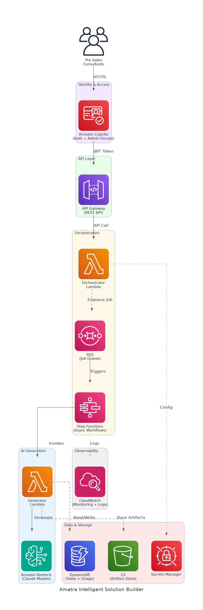

# Amatra Intelligent Solution Builder - Solution Briefing

## Slide Deck Structure
**11 Slides - Fixed Format**

---

### Slide 1: Title Slide
**layout:** eo_title_slide

**Presentation Title:** Solution Briefing
**Subtitle:** Amatra Intelligent Solution Builder
**Presenter:** [Presenter Name] | [Current Date]

---

### Slide 2: Business Opportunity
**layout:** eo_two_column

**Accelerating Proposal Velocity with AI-Powered Artifact Generation**

- **Opportunity**
  - Reduce engagement turnaround from 3 weeks to under 2 business days
  - Triple quarterly proposal throughput from 8 to 24 active engagements
  - Cut consulting hours per engagement by 40% through intelligent automation
- **Success Criteria**
  - Artifact turnaround under 2 business days after platform launch
  - 90%+ of generated artifacts pass internal QA on first review
  - 99.9% platform availability supporting 24 concurrent engagements per quarter

---

### Slide 3: Engagement Scope
**layout:** eo_table

**Sizing Parameters for This Engagement**

This engagement is sized based on the following parameters:

<!-- BEGIN SCOPE_SIZING_TABLE -->
<!-- TABLE_CONFIG: widths=[18, 29, 5, 18, 30] -->
| Parameter | Scope | | Parameter | Scope |
|-----------|-------|---|-----------|-------|
| **AI/ML Complexity** | Amazon Bedrock (Claude models) | | **Deployment Regions** | Single region (us-west-2) |
| **Artifact Types** | 7 pre-sales + delivery artifact types | | **Availability Requirements** | High (99.9% SLA) |
| **Concurrent Users** | ~120 internal users (pre-sales, delivery) | | **Compliance Frameworks** | SOC 2 Type II, GDPR-aligned |
| **User Roles** | 3 roles (pre-sales, delivery, admin) | | **Infrastructure Complexity** | Serverless (Lambda, Bedrock, S3) |
| **External Integrations** | Okta to Cognito identity migration | | **Security Requirements** | SOC 2, encryption at rest/transit |
| **Data Sources** | Client briefs, template libraries, CSVs | | **Processing Speed** | Async generation (30–60 min jobs) |
| **Data Storage Requirements** | S3 artifact store + DynamoDB state | | **Deployment Environments** | 3 environments (dev, staging, prod) |
| **Job Queue Depth** | Up to 24 concurrent generation jobs | | **Scope Complexity** | Medium-Large (greenfield build) |
<!-- END SCOPE_SIZING_TABLE -->

*Note: Changes to these parameters may require scope adjustment and additional investment.*

---

### Slide 4: Solution Overview
**layout:** eo_visual_content

**Serverless AI-Powered Consulting Artifact Generation Platform**

- **AI Generation Core**
  - Amazon Bedrock (Claude) generates consulting-grade artifact content
  - Step Functions orchestrate async 30–60 min generation workflows
- **Platform & API Layer**
  - API Gateway + Lambda expose secure REST endpoints for artifact jobs
  - Amazon Cognito handles auth with admin group governance controls
- **Data & Observability**
  - S3 stores artifacts; DynamoDB tracks solution state and usage limits
  - CloudWatch provides end-to-end monitoring and SLA visibility

---

### Slide 5: Implementation Approach
**layout:** eo_single_column

**Phased Delivery: Foundation to Full Automation**

- **Phase 1: Foundation & Pre-Sales MVP (Months 1-4)**
  - Deploy AWS serverless infrastructure: Lambda, API Gateway, Cognito, S3
  - Integrate Amazon Bedrock (Claude) for pre-sales artifact generation
  - Migrate Okta identities to Cognito with admin governance controls
- **Phase 2: Delivery Automation & Terraform (Months 5-8)**
  - Extend generation pipeline to delivery and Terraform artifact types
  - Implement per-user and global usage limits enforced via DynamoDB
  - Build QA validation layer ensuring 90%+ first-review pass rate
- **Phase 3: GA Rollout & Optimisation (Months 9-12)**
  - Onboard all 120 internal users with training and change management
  - Tune Bedrock prompts and pipelines based on production usage data
  - Achieve GA readiness ahead of 2027-01-31 flagship client renewal

**SPEAKER NOTES:**

*Risk Mitigation:*
- Greenfield build: use AWS Well-Architected serverless reference architecture to reduce rework
- Async job risk: SQS dead-letter queues and Step Functions retries prevent dropped 60-min jobs
- Timeline risk: phased milestones (MVP by Q3 2026) protect flagship renewal deadline

*Success Factors:*
- Head of Solutions actively validates artifact quality at each phase gate
- Representative client briefs available for Bedrock prompt tuning in Phase 1
- CTO executive sponsor ensures budget and resource continuity across all phases

*Talking Points:*
- Phase 1 MVP delivers measurable ROI before full platform is complete
- Each phase gates investment — Phase 2 only begins after MVP quality is validated
- SOC 2 compliance is designed in from Day 1, not retrofitted at Phase 3
- Okta migration de-risks identity early so Phase 2 can focus on generation features

---

### Slide 6: Timeline & Milestones
**layout:** eo_table

**Path to Value Realization**

<!-- TABLE_CONFIG: widths=[10, 25, 15, 50] -->
| Phase No | Phase Description | Timeline | Key Deliverables |
|----------|-------------------|----------|------------------|
| Phase 1 | Foundation & Pre-Sales MVP | Months 1-4 | Serverless infrastructure deployed, Bedrock generation live, Cognito migration complete |
| Phase 2 | Delivery Automation & Terraform | Months 5-8 | Full artifact pipeline operational, usage limits enforced, QA validation layer active |
| Phase 3 | GA Rollout & Optimisation | Months 9-12 | All 120 users onboarded, prompts tuned, GA live before 2027-01-31 renewal |

**SPEAKER NOTES:**

*Quick Wins:*
- First AI-generated pre-sales briefing delivered to internal reviewers by Month 2
- Okta identity migration complete and Cognito admin controls live by Month 3
- Pre-sales consultants using MVP in production by end of Month 4

*Talking Points:*
- Phase 1 MVP by Q3 2026 directly satisfies the board-level delivery milestone
- Phase 2 expands to full delivery pipeline, tripling the value of the platform
- GA in Q1 2027 provides a 30-day buffer ahead of the flagship renewal on 2027-01-31
- Each phase ends with a formal CTO sign-off, protecting budget and timeline integrity

---

### Slide 7: Success Stories
**layout:** eo_single_column

**Proven Results Automating Consulting Delivery**

- **Professional Services Firm (Mid-Market, 150 consultants)**
  - Challenge: Manual proposal cycle 18 days; only 6 pursuits per quarter
  - Solution: AWS Bedrock + Lambda async pipeline for proposal auto-generation
  - Result: Cycle cut to 3 days; pursuits tripled within 90 days
- **Cloud Consultancy (AWS Advanced Partner, 80 staff)**
  - Challenge: Inconsistent artifacts causing 35% QA rework before delivery
  - Solution: Structured AI generation with validation layer and templates
  - Result: QA rework dropped to 8%; delivery client NPS rose 22 points
- **SaaS-Focused Consulting Group (50 engineers, North America)**
  - Challenge: EC2 monolith causing 6-hour outages and delivery bottlenecks
  - Solution: Serverless migration to Lambda, S3, DynamoDB; 99.9% SLA design
  - Result: Zero unplanned outages post-launch; 45% ops overhead reduction

---

### Slide 8: Our Partnership Advantage
**layout:** eo_two_column

**Why Partner with Us for AWS Serverless AI**

- **What We Bring**
  - 10+ years delivering AWS cloud-native and AI/ML solutions at scale
  - 30+ serverless platform builds across professional services and SaaS
  - AWS Advanced Consulting Partner with Machine Learning Competency
  - Certified Solutions Architects with Bedrock and Lambda specialisation
- **Value to You**
  - Pre-built Bedrock prompt frameworks reduce generation tuning by 50%
  - Proven async job architecture handles 60-min jobs without dropped requests
  - Direct AWS ML specialist support accelerates Bedrock model optimisation
  - SOC 2 design patterns from 30+ builds fast-track compliance sign-off

---

### Slide 9: Investment Summary
**layout:** eo_table

**Total Investment & Value**

<!-- BEGIN COST_SUMMARY_TABLE -->
<!-- TABLE_CONFIG: widths=[25, 15, 15, 15, 12, 12, 15] -->
| Cost Category | Year 1 List | Year 1 Credits | Year 1 Net | Year 2 | Year 3 | 3-Year Total |
|---------------|-------------|----------------|------------|--------|--------|--------------|
| Professional Services | $380,000 | ($20,000) | $360,000 | $0 | $0 | $360,000 |
| Cloud Infrastructure | $60,000 | ($10,000) | $50,000 | $60,000 | $60,000 | $170,000 |
| Software Licenses | $8,400 | $0 | $8,400 | $8,400 | $8,400 | $25,200 |
| Support & Maintenance | $18,000 | $0 | $18,000 | $18,000 | $18,000 | $54,000 |
| **TOTAL** | **$466,400** | **($30,000)** | **$436,400** | **$86,400** | **$86,400** | **$609,200** |
<!-- END COST_SUMMARY_TABLE -->

**AWS Partner Credits (Year 1 Only):**
- AWS Partner Services Credit: $20,000 applied to architecture and AI/ML integration work
- AWS AI Services Consumption Credit: $10,000 for Bedrock first-year inference usage
- Total Credits Applied: $30,000 (6% discount through AWS Advanced Partnership)

**SPEAKER NOTES:**

*Value Positioning:*
- Lead with credits: You qualify for $30K in AWS partner credits reducing Year 1 cost
- Net Year 1 investment of $436K within the approved $300K–$450K budget range
- 3-year TCO of $609K versus $1.8M+ cost of manual delivery over the same period

*Credit Program Talking Points:*
- Real credits applied directly to AWS bills — not marketing figures
- We manage all credit paperwork and application through our AWS partnership
- High approval rate; credits confirmed at project kickoff before first invoice

*Handling Objections:*
- Can we build this ourselves? Partner credits and Bedrock frameworks only available through certified AWS partners
- Is Year 1 within budget? Yes — $436K net is within the $300K–$450K approved range
- When do we see ROI? Throughput improvement begins Month 4 at MVP; full ROI within 12 months

---

### Slide 10: Next Steps
**layout:** eo_bullet_points

**Your Path Forward**

- **Decision:** CTO executive approval for Phase 1 project by [specific date]
- **Kickoff:** Target Phase 1 start date within 30 days of approval
- **Team Formation:** Identify VP Engineering lead, Head of Solutions validator, and Security & Compliance reviewer
- **Week 1-2:** Contract finalisation, AWS account provisioning, and Cognito environment setup
- **Week 3-4:** Bedrock model access confirmed, Okta migration scoped, first prompt templates drafted

**SPEAKER NOTES:**

*Transition from Investment:*
- Now that we have covered the investment and proven ROI, let us talk about getting started
- Emphasize structured phased approach reduces risk and protects the flagship renewal deadline
- Show we can deliver a working MVP within 30 days of contract signature

*Walking Through Next Steps:*
- Decision needed to move forward — Phase 1 only, not full commitment upfront
- Three key stakeholders (CTO, VP Eng, Head of Solutions) must be confirmed in Week 1
- Security & Compliance Lead needs early involvement to align SOC 2 design in Week 2
- Our team is ready to begin infrastructure provisioning immediately upon approval

*Call to Action:*
- Schedule follow-up meeting with CTO and VP Engineering to confirm Phase 1 scope
- Request Okta user directory export to assess migration complexity
- Identify Head of Solutions artifact quality criteria for Bedrock prompt design
- Set hard decision date to protect Q3 2026 MVP delivery milestone

---

### Slide 11: Thank You
**layout:** eo_thank_you

**Presentation Title:** Thank You
**Subtitle:** Questions & Discussion
**Presenter:** [Presenter Name] | [Current Date]
